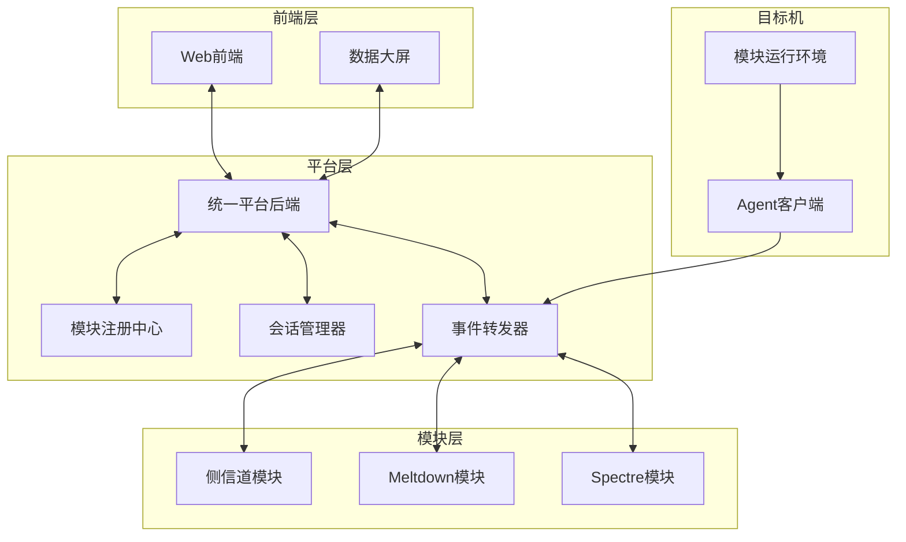

# CPU漏洞Poc/Exp复现工作介绍

## 项目概述

随着处理器架构复杂度的不断提升，CPU层面的安全漏洞层出不穷。从2018年震惊业界的Meltdown和Spectre系列漏洞开始，侧信道攻击、瞬态执行攻击等新型安全威胁持续涌现。这些漏洞利用现代处理器微架构设计中的缺陷，能够绕过传统的安全边界，实现跨特权域的信息泄露。然而，由于这些漏洞涉及底层硬件特性，复现难度大、环境要求苛刻，安全研究人员往往需要投入大量精力搭建实验环境、调试攻击代码。

本项目旨在构建一个统一的CPU漏洞Poc/Exp复现与演示平台，将分散的各类CPU漏洞Poc/Exp进行标准化封装，实现统一管理和调度。平台提供一键式部署和运行方案，降低漏洞复现的技术门槛，并通过Web前端实时展示攻击过程和结果，便于教学和展示。本项目的开展为安全研究人员提供标准化的漏洞复现环境，加速漏洞分析和防御研究，同时为企业和机构提供CPU安全评估工具，检测系统是否存在相关漏洞。

## Poc与Exp清单

本项目涵盖的Poc/Exp按照漏洞类型可分为三大类：侧信道漏洞、瞬态执行漏洞和架构错误漏洞。目前已成功集成17个Poc/Exp模块，覆盖Intel、AMD、ARM等主流处理器架构。

侧信道漏洞模块主要包括Flush+Reload和Prime+Probe两种经典的缓存侧信道攻击。Flush+Reload利用冲刷指令探测缓存行重用，攻击者首先将共享内存中的特定缓存行从缓存中驱逐，等待受害者执行后重新加载并测量访问时间，从而推断受害者的行为模式。Prime+Probe则不需要共享内存，攻击者用自己的数据填满目标缓存组，等待受害者执行后探测自己数据是否还在缓存中，从而泄露受害者的内存访问模式。

瞬态执行漏洞模块是本项目的核心内容，包括Meltdown系列和Spectre系列两大类。Meltdown系列涵盖Meltdown、Meltdown V3a、L1TF（Foreshadow）、Fallout、ZombieLoad等漏洞，利用现代处理器的乱序执行特性，允许用户态程序读取内核内存或跨安全域的信息。其中Fallout利用Intel CPU存储缓冲区的设计缺陷，即使在Meltdown已被硬件修复的CPU上，Store Buffer仍然会错误地将最近的store数据转发给后续的faulting load。ZombieLoad属于微架构数据采样（MDS）漏洞家族，攻击者可以通过诱导处理器在发生异常时，错误地将内部填充缓冲区中的陈旧数据提供给预测执行路径。

Spectre系列涵盖Spectre V1至V5、RetBleed、GhostRace、BPI、ITS、VMSCAPE等漏洞，利用分支预测机制实现瞬态执行攻击。其中BPI（分支特权注入，CVE-2024-45332）揭示了Intel处理器中分支预测器异步更新引发的竞态条件漏洞，突破了Spectre v2的硬件缓解措施（如eIBRS），攻击者可以在用户态向内核态注入特权分支预测，绕过特权域隔离。VMSCAPE则是一种针对虚拟化环境的分支目标注入攻击，攻击者可以从虚拟机内部攻击宿主机或其他虚拟机，突破虚拟化安全边界。

[此处应插入Poc/Exp模块分类统计图]

## 复现情况说明

本项目对已集成的17个模块进行了系统的复现测试，其中14个模块已成功复现，2个模块部分复现，1个模块仍在调试中。

在已成功复现的模块中，BPI漏洞的复现最具代表性。实验在Ubuntu 24.04虚拟机环境中进行，CPU为11th Gen Intel Core i5-11300H。通过配置内核参数关闭相关缓解措施，实验成功验证了BPI漏洞的触发效果。攻击流程包括分支训练、特权切换、BTB注入、侧信道检测四个阶段，通过性能计数器采集分支预测注入的命中次数，量化BPI漏洞的触发效果。实验结果显示jump指令类型的命中统计符合预期，成功实现了用户态向内核态的分支预测注入。

Fallout漏洞在WSL2环境中成功复现，Data Bounce原语测试显示真阳性率约31.2%，KASLR破解成功定位内核基址。但在VMware环境中由于虚拟化层的timing失真，复现效果受限，这体现了微架构漏洞对运行环境的敏感性。

ZombieLoad的复现情况则展示了硬件防御的有效性。在Intel Core i5-1235U（12代）CPU上进行测试时，由于硬件已实现MDS_NO防御机制，实验结果显示高噪声，未能产生针对目标字符的特定峰值。系统检测显示"Hardware is vulnerable to MDS: False"，证明第12代处理器在物理结构上不存在MDS泄露路径，攻击者仅能采样到微架构清理产生的随机噪声。

VMSCAPE模块目前仍在调试中，主要原因是需要完整的虚拟化环境配置，运行时间较长（预估5-30分钟），且需要精确控制虚拟机和宿主机的超线程调度，环境配置复杂度较高。

[此处应插入Poc/Exp复现成功率对比图]

## 复现工作量评估

各模块的复现工作量因复杂度、环境配置难度、调试难度等因素而异。侧信道攻击模块（Flush+Reload、Prime+Probe）复杂度较低，环境配置简单，工作量约1-2人天。Meltdown系列模块复杂度中等，需要特定的内核参数配置，工作量约3-7人天。Spectre系列模块中，基础变体（V1-V5）工作量约2-4人天，而高级变体如BPI、RetBleed、GhostRace等需要深入理解分支预测机制和精确的时序控制，工作量达5-15人天。VMSCAPE由于涉及虚拟化环境，复杂度极高，工作量达15-20人天。

复现过程中遇到的主要挑战包括虚拟化环境timing失真、内核参数配置复杂、CPU代际差异导致硬件修复等。针对这些挑战，项目组采取了优先使用WSL2或裸机环境、编写自动化配置脚本、在测试前检测CPU型号和漏洞状态等解决方案。同时，制定了统一的模块接入规范，开发自测工具验证模块合规性，有效提高了复现效率。

## 演示思路设计

演示流程设计为五个环节，总时长约23分钟。首先是平台首页展示环节，通过数据大屏展示平台整体功能、已集成漏洞模块统计图表、各类漏洞占比分布，让观众对平台有整体认识。其次是漏洞选择与详情查看环节，展示漏洞分类浏览功能、漏洞卡片和详情页面，让观众了解具体漏洞的技术细节。

核心环节是一键部署和实时攻击过程展示。在一键部署环节，选择目标漏洞模块后生成一键部署命令，在目标机器执行命令后Agent自动连接平台，展示平台的便捷性。在实时攻击过程展示环节，通过WebSocket实时事件流、阶段进度条动态更新、攻击数据实时可视化，让观众直观看到攻击的执行过程，理解攻击原理。推荐演示模块包括BPI（展示完整的分支预测注入过程）、Fallout（展示Data Bounce和KASLR破解效果）、Flush+Reload（展示缓存侧信道攻击的基本原理）。最后是攻击报告查看环节，展示Markdown格式报告渲染、攻击结果统计、漏洞存在性判断和修复建议。

演示安全防护措施包括环境隔离（所有演示在隔离的虚拟机环境中进行）、访问控制（平台设置访问密码、演示命令设置有效期限制）、数据安全（演示数据均为模拟数据、不使用真实敏感信息）和应急预案（准备备用演示环境、录制演示视频作为备选）。

## 技术实现概述

本项目采用模块化的微服务架构，整体架构分为前端层、平台层、模块层和目标机四个层次。前端层包括Web前端和数据大屏，平台层包括统一平台后端、模块注册中心、会话管理器和事件转发器，模块层包含各类Poc/Exp模块，目标机运行Agent客户端和模块运行环境。

统一平台后端采用Python 3.x + FastAPI/Uvicorn + WebSocket技术栈，负责模块注册与管理、会话生命周期管理、前端与Agent的消息转发、一键命令生成等功能。模块注册中心存储模块元数据，提供模块合规性验证和状态监控。Agent客户端负责接收平台命令、启动本地模块后端、转发模块事件到平台。

每个Poc/Exp模块必须遵循统一的接入规范，包括目录结构规范（module_spec.json、API.md、requirements.txt、启动脚本等）、控制接口规范（实现/attack/start、/attack/stop、/attack/reset、/attack/status四个HTTP接口）和事件流规范（通过WebSocket推送事件，遵循环境构建、攻击执行、报告生成的阶段顺序）。平台提供模块自测工具，用于验证模块是否正确接入，包括文件完整性检查、后端启动测试、控制接口测试、WebSocket连接测试和事件顺序验证。

## 成果与价值

本项目在技术层面完成了统一平台后端开发、模块化架构设计和标准化接入规范的制定，成功集成17个Poc/Exp模块，覆盖侧信道、Meltdown、Spectre三大类漏洞，支持Linux和Windows双平台，完成14个模块的成功复现，积累了详细的环境配置文档和完整的测试报告。在文档层面，形成了模块接入规范、前端对接文档、自测指南等技术文档，以及BPI、ZombieLoad、Fallout等漏洞的实验报告。

在安全研究价值方面，本项目通过复现深入理解了各类CPU漏洞的攻击原理，掌握了瞬态执行攻击和侧信道攻击的技术细节，验证了硬件防御措施的有效性，分析了不同代际CPU的安全差异，为防御方案设计提供了参考。同时提供了CPU安全评估工具，支持漏洞存在性检测，辅助安全加固决策。

在教学培训价值方面，本项目提供了直观的漏洞演示平台，降低了学习门槛，支持安全课程教学，培养了底层安全研究能力，提升了漏洞分析技能，积累了实战经验。

未来改进方向包括持续跟进最新CPU漏洞、扩展ARM架构支持、增加AMD特定漏洞、添加自动化测试流程、支持批量漏洞扫描、集成漏洞数据库、优化数据大屏展示、增加攻击过程动画、支持报告导出等功能增强，以及优化模块启动时间、减少资源占用、支持并行执行、增强异常处理、完善日志记录、提高容错能力等性能优化，同时加强访问控制、完善审计日志、支持安全配置、敏感数据加密、安全传输保障、数据清理机制等安全加固措施。

---

*文档版本：v1.0*  
*最后更新：2026年4月*
