# BPI 实验报告

## 本项目具体说明

BPI（Branch Privilege Injection，分支特权注入，CVE-2024-45332）揭示了 Intel 处理器中分支预测器异步更新引发的竞态条件漏洞，突破了 Spectre v2 的硬件缓解措施（如 eIBRS）。本项目详细描述并复现了这一漏洞的概念验证（POC）过程，通过利用分支预测器竞态条件（BPRC），实现在用户态向内核态注入特权分支预测，绕过特权域隔离，验证了 Intel 多代处理器的分支预测器特权隔离缺陷。该项目针对 Intel 11 代 Tiger Lake（i5-11300H）等多款处理器进行了验证，实验基于 Ubuntu 24.04 虚拟机环境完成。

## 涉及资源

- **Branch Predictor (分支预测器)**
  - **位置**: CPU 内部 (Branch Target Buffer - BTB)
  - **功能**: 存储间接分支指令的目标地址，为处理器流水线提供分支预测，加速指令执行；eIBRS 等硬件缓解措施本应限制不同特权域的分支预测隔离。
  - **利用**: Intel 处理器的分支预测器更新具有异步性，特权域切换（如 syscall）可能先于分支预测条目插入，导致用户态训练的分支预测被标记为内核特权，形成BPRC（Branch Predictor Race Conditions） 漏洞，攻击者可借此向内核态注入任意分支预测。

- **Kernel Module (ap.ko)**
  - **位置**: 实验项目uarch-research-fw/kmod_ap/目录下编译生成的内核模块
  - **功能**: 提供用户态访问内核态分支预测器的接口，解除 SMEP/SMAP 限制，允许实验中在不同特权域执行相同的分支代码。
  - **利用**: 实验依赖该模块实现特权域的分支指令执行控制，是复现 BPI 漏洞的核心辅助组件。

- **Performance Counter (性能计数器)**
  - **位置**: CPU 内部性能监控单元
  - **功能**: 统计分支预测错误数、缓存命中 / 未命中数等微架构状态数据。
  - **利用**: 实验通过性能计数器采集分支预测注入的命中次数，量化 BPI 漏洞的触发效果，将微架构的隐形状态转化为可观测的实验数据。

- **Side Channel (侧信道)**
  - **位置**: CPU L3 缓存
  - **功能**: 利用缓存访问的时间差异（Hit 快，Miss 慢）传递分支预测注入的结果。
  - **利用**: 实验通过缓存侧信道检测内核态是否执行了用户态注入的分支预测目标，验证 BPI 漏洞的实际触发效果。

## 攻击原理

```mermaid
graph TD
    A[Start POC in Guest VM] --> B{Step 1: BTB Training};
    B -- User-Mode Indirect Branch --> C[Train BTB with Speculative Gadget];
    C -- Async BTB Update --> D[BTB Entry in Pending State];
    D --> E{Step 2: Privilege Race};
    E -- Trigger syscall --> F[U→K Privilege Domain Switch];
    F -- Race Condition --> G[Privilege Switch Prior to BTB Insert];
    G --> H{Step 3: BPI Injection};
    H -- Async BTB Insert --> I[Mark User Branch as Kernel Privilege];
    I -- Break eIBRS Isolation --> J[Form BPRC_U→K Vulnerability];
    J --> K{Step 4: Side Channel Detect};
    K -- Execute Same Branch in Kernel --> L[Trigger Speculative Execution];
    L -- Cache Hit/Miss --> M[Count Branch Prediction Hits via RB];
    M --> N{Step 5: Quantify Vulnerability};
    N -- Multi-Round Experiment --> O[Calculate Median/Avg Hits per Round];
    O -- Stats Analysis --> P[Verify BPI Exploitability];
    P --> Q[BPI Vulnerability Confirmed];
```



**BPI 触发核心原理**:
1.  **训练**: 攻击者在用户态执行间接分支指令，训练 BTB 记录预测目标，此时分支预测器的更新处于异步等待状态。
2.  **竞态**: 立即触发 syscall 执行用户态→内核态的特权域切换，利用分支预测器更新的延迟，让特权切换先于 BTB 条目插入完成。
3.  **注入**: 异步的 BTB 条目插入时，错误将该预测标记为内核特权，突破 eIBRS 的特权域隔离限制，形成 BPI 漏洞。
4.  **检测**：在内核态执行相同的分支源地址，通过缓存侧信道检测是否执行了用户态训练的预测目标，统计命中次数验证漏洞触发效果。
5.  **量化**：实验重复执行多轮分支训练 - 注入 - 检测流程，通过性能计数器和自定义统计逻辑，输出每轮命中数、平均命中值等指标，量化 BPI 漏洞的触发成功率。

## 项目核心代码文件

- **`bprc/experiments/exp-leak-supervisor/main.c`**: PI 漏洞验证的核心 POC 代码，包含分支训练、特权切换、BTB 注入、侧信道检测的主逻辑，定义实验轮次、攻击指令类型等核心参数。
- **`bprc/experiments/exp-leak-supervisor/Makefile`**: 实验代码编译脚本，适配不同 Intel 微架构（如 Tiger Lake/Skylake）的编译参数，链接底层微架构操作库。
- **`bprc/experiments/uarch-research-fw/kmod_ap/ap.c`**: ap.ko 内核模块的源码，实现用户态与内核态的分支预测器访问接口，解除 SMEP/SMAP 限制。
- **`bprc/experiments/exp-leak-supervisor/analyze.py`**: 实验结果分析脚本，解析实验输出的命中数据，统计 BPI 注入的成功率和有效性。
- **`bprc/ansible/run.yaml`**: 自动化实验执行脚本，可批量配置实验环境、执行实验并收集结果（本实验采用手动执行方式）。

## 运行环境

- **软件环境**:
  - **语言**: C, Python, Bash, Make
  - **系统**: VMware Virtual Platform Ubuntu 24.04（实验核心运行环境）
  - **依赖工具**: gcc, make, linux-headers-$(uname -r), sysctl, taskset, insmod

- **硬件版本**:
  - **CPU**: 11th Gen Intel(R) Core(TM) i5-11300H
  - **架构**: x86_64
  - **限制**: 关闭超线程（SMT）、CPU 睿频、irqbalance 服务，减少分支预测器的干扰噪声；绑定实验至单个 CPU 核心执行。

- **启动参数 (Kernel)**:
  - `mitigations=off`: 关闭 Spectre/Meltdown 相关硬件缓解措施，确保 BPRC 漏洞环境存在。
  - `nosmap nosmep`: 关闭内核态 / 用户态内存访问限制，允许实验跨特权域执行代码。
  - `isolcpus=0 nohz_full=0 rcu_nocbs=0`: 隔离 0 号 CPU 核心，禁止内核调度干扰，保证实验时序稳定性。

## 执行步骤

### 配环境步骤
1.  **配置 Guest 系统 GRUB**:
    修改 Guest 的 GRUB 配置 (/etc/default/grub)，添加内核漏洞缓解关闭参数，关闭所有干扰项：
    ```bash
    GRUB_CMDLINE_LINUX_DEFAULT="quiet splash"
    GRUB_CMDLINE_LINUX="mitigations=off nosmap nosmep nopti nospectre_v2 nospectre_v1 l1tf=off mds=off tsx_async_abort=off ssbd=off intel_iommu=off isolcpus=0 nohz_full=0 rcu_nocbs=0"
    sudo update-grub && sudo reboot
    ```
2.  **安装实验依赖**:
    ```bash
    sudo apt update && sudo apt upgrade -y
    sudo apt install -y git make gcc linux-headers-$(uname -r) build-essential python3 python3-pip
    pip install matplotlib
    ```
3.  **克隆实验仓库**:
    拉取 BPI 漏洞的官方实验代码仓库:
    ```bash
    git clone https://github.com/comsec-group/bprc.git
    cd bprc-main
    ```


### 运行步骤
1.  **编译并加载核心内核模块**:
    进入内核模块目录，编译并加载 ap.ko，为实验提供特权域访问接口：
    ```bash
    cd experiments/uarch-research-fw/kmod_ap/
    make clean && make
    sudo insmod ap.ko
    lsmod | grep ap
    ```
2.  **进入 BPI 核心实验目录**:
    切换至exp-leak-supervisor目录，该目录为 BPI 漏洞用户态→内核态注入的核心验证实验

3.  **关闭系统运行干扰**:
    执行系统参数配置，关闭性能计数器限制、IRQ 均衡、CPU 睿频，保证实验时序稳定:
    ```bash
    sudo sysctl -w kernel.perf_event_paranoid=-1
    sudo sysctl -w kernel.kptr_restrict=0
    echo 1 | sudo tee /sys/devices/system/cpu/intel_pstate/no_turbo
    echo performance | sudo tee /sys/devices/system/cpu/cpu0/cpufreq/scaling_governor
    ```
4.  **编译实验 POC 代码**:
    ```bash
    make clean && make MARCH=tigerlake
    ```
5.  **执行 BPI 漏洞验证实验**:
    绑定 0 号 CPU 核心执行实验，避免调度干扰，输出实验结果至日志文件：
    ```bash
    sudo taskset -c 0 ./main 0 | tee bpi_poc_result.log
    ```


### 预期效果

**运行日志示例**:

```text
[-] Using custom msr value: 0x1
[-] finding leaks
[-] running jump_
### RESULTS START ###
jump_hits_per_round_median = 0
jump_hits_per_round_avg = 0.079380
jump_hits_per_round_count_gt0 = 3384
jump_hits_per_round_sum = 7938
jump_check = 1
### RESULTS END ###
[-] running call_
### RESULTS START ###
call_hits_per_round_median = 0
call_hits_per_round_avg = 0.013870
call_hits_per_round_count_gt0 = 676
call_hits_per_round_sum = 1387
call_check = 0
### RESULTS END ###
[-] running ret_
### RESULTS START ###
ret_hits_per_round_median = 0
ret_hits_per_round_avg = 0.000000
ret_hits_per_round_count_gt0 = 0
ret_hits_per_round_sum = 0
ret_check = 0
### RESULTS END ###
```


### 参考资料
# 1.https://www.usenix.org/conference/usenixsecurity25/presentation/ruegge
# 2.https://github.com/comsec-group/bprc