# GhostRace 实验报告

## 本项目具体说明

GhostRace（CVE-2024-2193）揭示了同步原语在投机执行场景下的安全缺陷，展示了一种新型投机执行漏洞——投机性竞争条件（Speculative Race Conditions, SRCs）。本项目详细描述并复现了端到端的漏洞利用，通过绕过Linux内核中常见的同步原语（如互斥锁、自旋锁），将架构上无竞争的临界区转化为投机性并发释放后使用（Speculative Concurrent Use-After-Free, SCUAF）漏洞，最终实现从非特权用户态窃取内核内存中的敏感数据（如根密码哈希）。该漏洞已在Intel 12代（Alder Lake）、13代（Raptor Lake）及AMD Ryzen 9 5950X等处理器上验证。

## 涉及资源

- **Synchronization Primitives（同步原语）**
  - **位置**: Linux内核源码（如mutex、spinlock实现）
  - **功能**: 保证多线程对共享资源的互斥访问，避免架构层面的竞争条件。
  - **利用**: 同步原语的实现依赖条件分支（如mutex_lock中的cmpxchg指令后的分支判断），攻击者可通过训练分支预测器，使CPU投机性绕过互斥锁，进入已被其他线程占用的临界区。

- **CPU Branch Predictor（分支预测器）**
  - **位置**: CPU内部（Branch Target Buffer, BTB）
  - **功能**: 预测条件分支的执行方向，加速指令流水线。
  - **利用**: 攻击者通过多次获取锁的正常执行路径训练分支预测器，使其在锁已被占用时仍预测“锁可用”，从而触发投机性执行进入临界区。

- **Unbounded UAF Window（无界UAF窗口）**
  - **位置**: 内核线程执行上下文
  - **功能**: 原本极短的“释放后未置空”时间窗口（仅8条指令）。
  - **利用**: 结合高精度定时器中断和跨处理器中断（IPI）风暴，中断目标线程并无限拉长UAF窗口，为多次投机执行漏洞利用提供时间保障。

- **SCUAF Gadgets（SCUAF漏洞 gadget）**
  - **位置**: Linux内核代码（如设备驱动、内核服务模块）
  - **功能**: 架构上无竞争的临界区代码，包含“释放共享对象+使用共享对象”的逻辑。
  - **利用**: 攻击者通过投机性绕过同步原语，使“释放”和“使用”操作并发执行，触发悬垂指针解引用，进而劫持投机执行流。

- **Flush+Reload Covert Channel（Flush+Reload隐蔽信道）**
  - **位置**: 内核与用户态共享的内存区域（如直接映射物理内存）
  - **功能**: 利用CPU缓存访问时间差异传递数据。
  - **利用**: 攻击者在用户态维护缓存缓冲区，内核中的投机执行gadget通过访问缓冲区编码敏感数据，用户态通过测量缓存命中/未命中时间还原数据。

## 攻击原理

```mermaid
graph TD
    A[Start Attack as Unprivileged User] --> B{Step 1: Train Branch Predictor};
    B -- Repeated Lock Acquisition --> C[Mistrain Mutex Conditional Branch];
    C --> D{Step 2: Create Unbounded UAF Window};
    D -- High-Precision Timer --> E[Interrupt Victim Thread Post-kfree];
    E -- IPI Storm --> F[Halt Victim Thread, Stretch Window];
    F --> G{Step 3: Memory Reuse};
    G -- Slab Massaging --> H[Reallocate Freed Object with Malicious Callback];
    H --> I{Step 4: Speculative Bypass Sync Primitive};
    I -- Mispredicted Branch --> J[Enter Critical Region Speculatively];
    J --> K{Step 5: Control-Flow Hijack};
    K -- Dereference Dangling Pointer --> L[Execute Malicious Callback];
    L -- Encode Data to Cache --> M[Access Flush+Reload Buffer];
    M --> N{Step 6: Data Leak};
    N -- Measure Cache Timing --> O[Recover Sensitive Kernel Data];
    O --> P[Repeat for Full Secret Reconstruction];
```



**时间差异产生原理**:
1.  **编码**: 投机执行的恶意回调通过maccess访问缓存缓冲区的特定偏移，将敏感数据值映射为缓存命中事件（如secret=0x0A对应访问fr_buff[0x0A*4096]）。
2.  **解码**: 攻击者通过probe_timing函数测量缓冲区不同偏移的访问时间，缓存命中（<200 周期）对应敏感数据的特定值，未命中（>300 周期）则排除该值。
3.  **结论**: 结合滑动窗口技术处理小步长编码和预取器干扰，通过多次采样即可还原完整的敏感数据。

## 项目核心代码文件

- **`ghostrace/src_poc/src.c`**: 漏洞验证核心代码，实现单线程模拟双线程竞争、投机性 UAF 触发及 Flush+Reload 信道检测。
- **`ghostrace/src_poc/Makefile`**: 实验代码编译脚本，适配不同 Intel 微架构（如 Tiger Lake/Skylake）的编译参数，链接底层微架构操作库。
- **`ghostrace/src_poc/fr.h`**: 隐蔽信道工具库，包含probe_timing（缓存访问计时）、maccess（内存访问）、flush（缓存刷新）等原语。

## 运行环境

- **软件环境**:
  - **语言**: C、Shell 
  - **系统**: VMware Virtual Platform Ubuntu 20.04 LTS（内核版本 5.4.0）
  - **依赖工具**:  gcc、make、linux-headers-$(uname -r)

- **硬件版本**:
  - **CPU**: 11th Gen Intel(R) Core(TM) i5-11300H
  - **架构**: x86_64

- **启动参数 (Kernel)**:
  - `mitigations=off`: 关闭 Spectre/Meltdown 相关硬件缓解措施，确保确保投机执行可被利用。
  - `nosti`: 禁用 KPTI（内核页表隔离），简化内核内存访问（可选，用于加速测试）。

## 执行步骤

### 配环境步骤
1.  **配置内核环境**:
    ```bash
    # 安装目标内核及头文件
    sudo apt install -y linux-image-5.15.83-generic linux-headers-5.15.83-generic
    # 修改GRUB配置，添加内核参数
    sudo sed -i 's/GRUB_CMDLINE_LINUX=""/GRUB_CMDLINE_LINUX="mitigations=off nopti"/' /etc/default/grub
    sudo update-grub && sudo reboot
    ```
2.  **安装实验依赖**:
    ```bash
    sudo apt install -y gcc make coccinelle
    ```
3.  **克隆实验仓库**:
    拉取 BPI 漏洞的官方实验代码仓库:
    ```bash
    git clone https://github.com/vusec/ghostrace.git
    cd ghostrace
    ```


### 运行步骤
1.  **编译poc代码**:
    ```bash
    # 进入PoC源码目录
    cd src_poc
    # 编译生成可执行文件
    make
    ```
2.  **执行漏洞验证 PoC**:
    ```bash
    ./src
    ```

### 预期效果

**运行日志示例**:

```text
Got signal (134 < 393): Memory reuse, Speculative UAF, and Speculative control-flow hijack triggered successfully.
```

### 参考资料

# 1.https://www.usenix.org/conference/usenixsecurity24/presentation/ragab
# 2.https://github.com/vusec/ghostrace