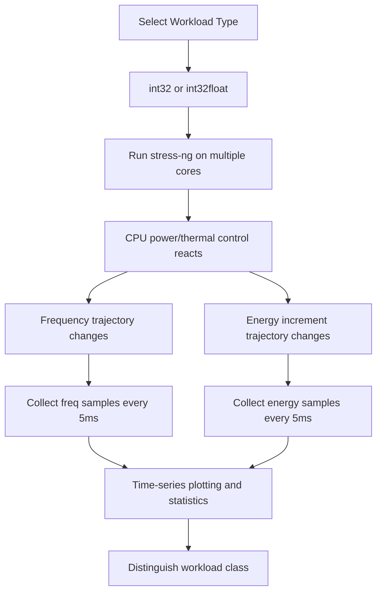

# Hertzbleed 实验报告

## 本项目具体说明

Hertzbleed（USENIX Security 2022）展示了一个关键事实：即使攻击者无法直接读取功耗传感器，也能通过远程可观测的执行时间，间接恢复处理器动态调频（DVFS）引起的功耗差异。本实验基于仓库 `hertzbleed` 的 `01-leakage-channel-workloads` 子项目，复现“不同指令型工作负载会导致可区分频率/功耗轨迹”的基础泄露通道。

本次实验在 AMD Ryzen 7 7840H 平台完成，针对原始 Intel 路径做了最小兼容改造（频率读取与能耗读取接口适配），成功生成两组轨迹图：

- `stress_int32float_000000.pdf`
- `stress_int32_000001.pdf`

并验证了两类 workload 在频率与功耗上存在可统计区分差异。

## 涉及资源

- **DVFS / Boost（动态电压频率调节）**
  - **位置**: CPU 电源管理与频率控制路径（`cpufreq`）
  - **功能**: 根据负载、温度和功耗预算动态调整频率。
  - **利用**: 不同指令混合导致不同功耗密度，进而触发不同频率轨迹，形成侧信道可观测量。

- **APERF/MPERF 与频率采样接口**
  - **位置**: x86 性能计数路径（原始实现）与 `/sys/devices/system/cpu/cpu*/cpufreq/scaling_cur_freq`（兼容实现）
  - **功能**: 反映 CPU 实际运行频率。
  - **利用**: 频率时间序列可用于区分 workload 类型。

- **RAPL / Powercap 能耗接口**
  - **位置**: MSR RAPL 或 `/sys/class/powercap/*/energy_uj`
  - **功能**: 提供封装能耗累计值。
  - **利用**: 相邻采样点能量差可转换为功率轨迹，用于与频率轨迹联合分析。

- **Stress-ng 压力工作负载**
  - **位置**: 用户态压力工具
  - **功能**: 生成特定 CPU 指令模式（`int32`、`int32float`）。
  - **利用**: 作为“待区分信号源”，验证“工作负载类型 -> 频率/功耗特征”映射关系。

## 攻击原理



**核心逻辑**:
1. 不同工作负载（例如整数密集 vs 混合整数/浮点）会导致不同的瞬时功耗和热行为。  
2. 处理器 DVFS/Boost 控制回路会将这种差异映射为不同频率演化曲线。  
3. 采样频率和能耗增量后，可以通过可视化或统计方法将两类负载区分开。  
4. 一旦“机密相关计算路径”与负载模式相关，该信道可被用于推断机密信息。  

## 项目核心代码文件

- **`01-leakage-channel-workloads/run.sh`**: 实验总控脚本。加载 `msr` 模块、组织 workload 轮次、触发 `driver` 采样并归档输出。
- **`01-leakage-channel-workloads/driver.c`**: 采样核心程序。并行启动 stress workload 与监控线程，按 5ms 间隔记录频率/能耗序列。
- **`01-leakage-channel-workloads/plot.py`**: 绘图脚本。读取 `out-*` 数据，做异常值与前若干样本处理，输出频率+功率双子图 PDF。
- **`util/freq-utils.c`**: 频率读取工具函数（本次实验使用 `cpufreq` 路径）。
- **`util/rapl-utils.c`**: 能耗读取工具函数（优先使用 powercap `energy_uj` 接口，失败再回退 MSR 路径）。

## 运行环境

- **软件环境**:
  - **语言**: C, Python, Bash
  - **系统**: Ubuntu 24.04
  - **依赖**: `build-essential`, `stress-ng`, `python3-venv`, `numpy`, `matplotlib`

- **硬件环境**:
  - **CPU**: AMD Ryzen 7 7840H
  - **逻辑核**: 8（实验中在线核心）
  - **关键状态**: Boost 打开（`/sys/devices/system/cpu/cpufreq/boost = 1`）

- **实验参数**:
  - 采样间隔: 5ms
  - 每条轨迹采样点: 3500（约 17.5s）
  - workload: `int32float`、`int32`
  - 轮次: `k=1`（本次记录）

## 执行步骤

### 配环境步骤
1. 安装依赖：
   ```bash
   sudo apt install -y build-essential stress-ng python3-venv python3-pip
   ```
2. 编译项目：
   ```bash
   cd 01-leakage-channel-workloads
   make clean && make
   ```
3. 准备 Python 环境：
   ```bash
   python3 -m venv .venv
   source .venv/bin/activate
   pip install -U pip
   pip install numpy matplotlib
   ```
4. 打开可变频模式（AMD 路径）：
   ```bash
   cd ../scripts
   bash set-variable-pstate.sh
   cat /sys/devices/system/cpu/cpufreq/boost
   ```

### 运行步骤
1. 采集轨迹：
   ```bash
   cd ../01-leakage-channel-workloads
   ./run.sh
   ```
2. 绘制图像（示例目录）：
   ```bash
   source .venv/bin/activate
   python3 plot.py data/out-0521-2007
   ```
3. 结果文件：
   - 原始数据：`out/freq_*.out`, `out/energy_*.out`
   - 归档数据：`data/out-0521-2007/`
   - 图像：`plot/stress_int32float_000000.pdf`, `plot/stress_int32_000001.pdf`

### 预期效果

运行 `./run.sh` 时会依次打印两条 workload 命令，例如：

```text
This script will take about 3 minutes
Running: taskset -c 0-7 stress-ng -q --cpu 8 --cpu-method int32float -t 10m
Running: taskset -c 0-7 stress-ng -q --cpu 8 --cpu-method int32 -t 10m
```

绘图完成后，`plot/` 下应生成两份 PDF，每份包含上半频率曲线和下半功率曲线。

## 实测结果

基于本次采样数据（每类 3490 个有效点，去掉前 10 个样本后）：

- 频率均值（GHz）
  - `int32float`: `4.8722`
  - `int32`: `4.9099`
  - 差值（`int32 - int32float`）: `+0.0378 GHz`

- 功率均值（W）
  - `int32float`: `43.20`
  - `int32`: `36.43`
  - 差值（`int32 - int32float`）: `-6.76 W`

- 可分离性（Cohen's d）
  - 频率: `1.49`
  - 功率: `-1.75`

结果说明两类 workload 在该平台上具有明显可分离特征。

## 结论

1. 本实验成功复现了 Hertzbleed 的基础泄露前提：工作负载类型可映射为稳定可观测的频率/功率差异。  
2. 在 AMD 7840H + Ubuntu 24.04 环境中，`int32` 与 `int32float` 的轨迹已可被统计显著地区分。  
3. 该结果支持后续更复杂实验（数据相关泄露模型、密码实现侧信道）继续开展。  
4. 当前仅采集 `k=1`，建议扩展至 `k>=5` 并增加置信区间分析，以提升结论稳健性。  

## 参考资料

1. Hertzbleed 论文主页: https://www.hertzbleed.com  
2. 论文 PDF: https://www.hertzbleed.com/hertzbleed.pdf  
3. 实验代码仓库: https://github.com/hertzbleed/hertzbleed  
