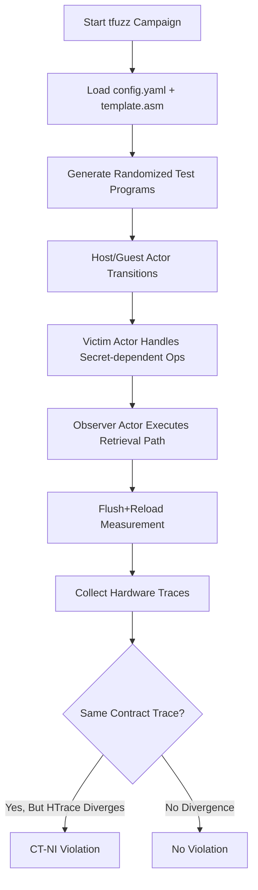

# TSA-L1D 实验报告

## 本项目具体说明

TSA-L1D（Transient Scheduler Attack - L1 Data Cache Variant）是针对 CPU 隔离边界（Host/Guest、Kernel/User）的一类瞬态执行侧信道漏洞。该漏洞利用上下文切换窗口中的微架构状态残留，使攻击者能够通过缓存观测恢复受害者相关信息。

本实验基于 Revizor (`side-channel-fuzzer`) 的模板模糊测试模式（`tfuzz`）进行复现，目标是验证 AMD Zen 4 平台在特定配置下是否出现可重复的 CT-NI（Actor Non-Interference）违规。实验结果显示，工具在 `demo/tsa-l1d` 配置下检测到稳定的硬件轨迹分化，满足漏洞触发特征。

## 涉及资源

- **调度切换路径（Host/Guest 切换）**
  - **位置**: 模板中的 `switch_h2g` / `switch_g2h` 宏路径。
  - **功能**: 模拟 Hypervisor 与 VM 的执行切换边界。
  - **利用**: 在边界切换窗口中制造瞬态执行机会，使前序域的微架构影响泄露到后序观测域。

- **L1 Data Cache（L1D）**
  - **位置**: CPU 一级数据缓存。
  - **功能**: 缓存近期数据访问，加速访存。
  - **利用**: 即使瞬态路径最终被回滚，缓存状态变化仍可保留并被攻击者观测。

- **Flush+Reload 观测机制（F+R）**
  - **位置**: Revizor 执行器（`executor_mode: F+R`）。
  - **功能**: 通过 flush 后 reload 的时延差异采样缓存命中模式。
  - **利用**: 将不可直接读取的瞬态信息转化为可统计区分的硬件轨迹（HTrace）。

- **CT-NI 合约（`contract_observation_clause: ct-ni`）**
  - **位置**: `demo/tsa-l1d/config.yaml`。
  - **功能**: 检查观察者 Actor 是否能从非观察者 Actor 的行为中获得不应见信息。
  - **利用**: 若同一 contract trace 下出现输入相关 HTrace 分叉，则判定为隔离违规。

- **HPA/GPA 冲突配置（`x86_enable_hpa_gpa_collisions: true`）**
  - **位置**: `demo/tsa-l1d/config.yaml`。
  - **功能**: 放宽主机物理地址与客体物理地址映射冲突建模。
  - **利用**: 提高跨域微架构干扰被触发与观测的概率。

## 攻击原理



**核心利用逻辑**:
1. 通过模板中的多 Actor 切换宏构造隔离边界执行路径。
2. 由 `vmvictim` 执行含秘密注入的随机指令段，再切换到 `vm` 观察者路径。
3. 观察者路径在清理寄存器后执行秘密检索阶段，并通过 F+R 形成硬件轨迹。
4. 若不同输入（如 ID:4、ID:54）在相同 contract trace 下出现显著不同 HTrace 模式，即说明存在微架构泄露通道。

## 项目核心代码文件

- **`demo/tsa-l1d/config.yaml`**: TSA-L1D 复现实验主配置，定义 Actor、观测合约、执行器、采样规模与过滤策略。
- **`demo/tsa-l1d/template.asm`**: 攻击模板，描述 host/vmvictim/vm 三角色切换、秘密注入与观测流程。
- **`rvzr/cli.py`**: `rvzr tfuzz` 命令入口与参数解析。
- **`rvzr/fuzzer.py`**: 模糊测试主循环，负责测试用例生成、执行、统计判定。
- **`rvzr/executor.py`**: 测试用例执行与硬件轨迹采样。
- **`rvzr/analyser.py`**: 统计分析与违规判定逻辑。
- **`violation-260126-190258/report.txt`**: 已捕获违规样本的详细报告（本实验结果依据）。

## 运行环境

- **软件环境**:
  - **工具版本**: Revizor `2.0.0`（`pyproject.toml`）
  - **执行模式**: `tfuzz`
  - **基础 ISA 规格文件**: `base.json`
  - **系统**: Linux（实验记录为 `6.14.0-37-generic`）

- **硬件版本**:
  - **CPU**: AMD Ryzen 7 7840H（Zen 4）
  - **架构**: x86_64

- **启动参数 (Kernel)**:
  - `mitigations=off`: 关闭通用推测执行软件缓解，暴露真实微架构行为。
  - `nosmt`: 关闭 SMT，减少并发噪声，提升统计稳定性。

## 执行步骤

### 配环境步骤
1.  **准备 Python 虚拟环境并安装依赖**:
    ```bash
    python3 -m venv .venv
    . .venv/bin/activate
    pip install -e .
    ```
2.  **确认基础规格文件存在**:
    ```bash
    ls base.json
    ```
3.  **确认 TSA-L1D 模板与配置文件存在**:
    ```bash
    ls demo/tsa-l1d/config.yaml demo/tsa-l1d/template.asm
    ```

### 运行步骤
1.  **执行 TSA-L1D 检测任务**:
    ```bash
    .venv/bin/rvzr tfuzz -s base.json -c demo/tsa-l1d/config.yaml -t demo/tsa-l1d/template.asm -i 50 -n 10000
    ```
2.  **复现实验中已保存的违规样本（可选）**:
    ```bash
    .venv/bin/rvzr reproduce -s base.json -c violation-260126-190258/reproduce.yaml -t violation-260126-190258/program.asm -i violation-260126-190258/input_0004.bin violation-260126-190258/input_0054.bin
    ```

### 预期效果

**运行日志示例（节选）**:

```text
================================ Violations detected ==========================
Violation Details:

-----------------------------------------------------------------------------------
                             HTrace                              | ID:4   | ID:54 |
-----------------------------------------------------------------------------------
^..^...^....................^.............^..................... | 310    | 0     |
^^.^...^....................^.............^..................... | 127    | 436   |
^......^....................^.............^..................... | 1      | 0     |
```

**违规报告关键字段（`violation-260126-190258/report.txt`）**:
- 检测时间: `26.01.26 19:02:58`
- 触发测试用例: `Test Case ID 8025`
- 检测耗时: `14556.892595s`
- 对比输入: `Input #4` 与 `Input #54`
- 关键现象: 两组输入共享相同 contract trace hash，但出现显著不同的 HTrace 分布。

## 实验结论

本实验在 AMD Ryzen 7 7840H（Zen 4）平台上，基于 Revizor 的 `demo/tsa-l1d` 配置成功检测到 CT-NI 违规。结果表明：在指定配置与统计条件下，L1D 缓存状态可携带跨隔离边界的可观测信息，符合 TSA-L1D 侧信道漏洞的复现特征。

## 参考资料

1. https://github.com/microsoft/side-channel-fuzzer
2. https://microsoft.github.io/side-channel-fuzzer/
3. https://www.microsoft.com/en-us/research/wp-content/uploads/2025/07/Enter-Exit-SP26.pdf
