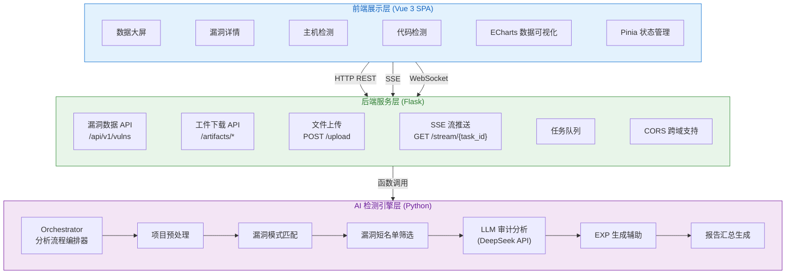
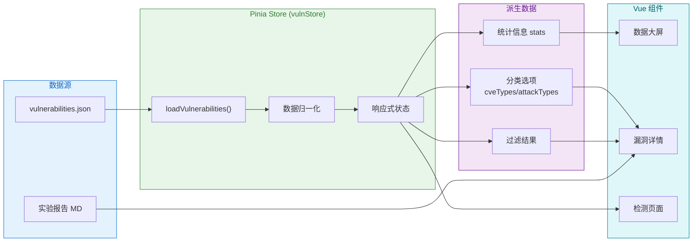
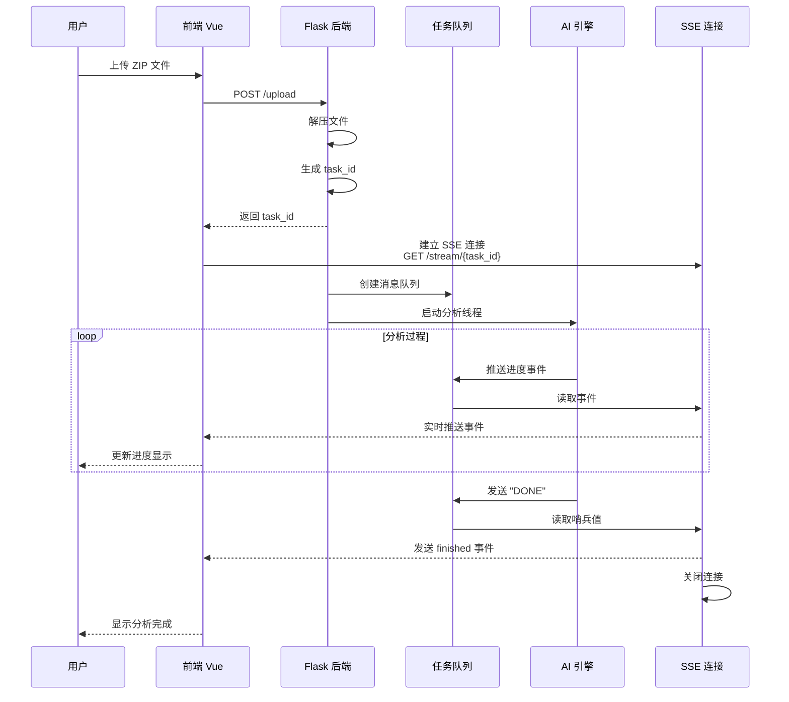
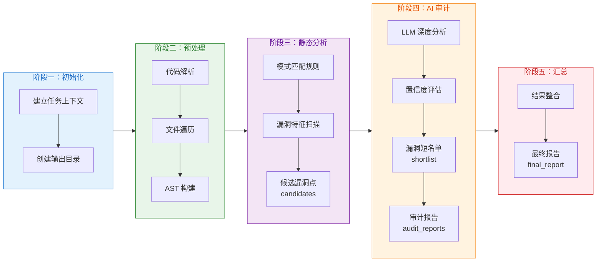
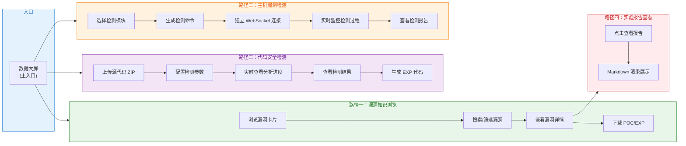
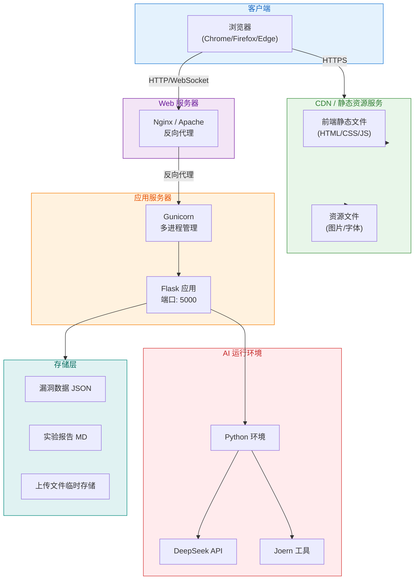

# NeuralCore — 侧信道漏洞智能检测平台 设计与实现文档

---

## 一、系统总体设计

### 1.1 系统概述

NeuralCore 是一个面向 CPU 侧信道漏洞研究与教学的综合性平台，集漏洞知识库浏览、POC/EXP 代码资源管理、AI 驱动的代码审计检测、目标主机远程漏洞检测于一体。平台采用 B/S 架构，前端基于 Vue 3 构建 SPA 应用，后端由 Flask 服务与 AI 侧信道检测引擎（Python）组成，通过 SSE 与 WebSocket 实现前后端实时双向通信。

### 1.2 系统架构

系统整体分为三层：前端展示层、后端服务层、AI 检测引擎层。前端展示层负责页面渲染、数据可视化与用户交互；后端服务层提供漏洞数据 API、代码工件下载接口以及文件上传与任务调度能力；AI 检测引擎层基于大语言模型对上传的源代码进行静态分析与漏洞推理，逐步产出候选漏洞点、候选短名单、审计分析报告与最终总结报告。



### 1.3 技术选型

前端采用 Vue 3 组合式 API 作为核心框架，配合 Pinia 进行全局状态管理，Vue Router 实现路由导航与页面懒加载。数据可视化方面使用 ECharts 绘制饼图、条形图、热力图、折线图等多种图表，辅以 echarts-gl 支持三维扩展能力。UI 风格基于自定义 CSS 变量体系，实现了毛玻璃卡片、霓虹渐变、脉冲动画等科技风视觉元素。后端使用 Flask 提供 RESTful API，通过 SSE（Server-Sent Events）推送任务执行进度，支持 CORS 跨域访问。AI 引擎使用 Python 编写，集成 DeepSeek 大语言模型 API 进行代码审计推理。

---

## 二、数据层设计

### 2.1 漏洞数据结构

平台的漏洞数据以 JSON 格式统一维护，存储在 `public/data/vulnerabilities.json` 中。每条漏洞记录包含标识信息、分类信息、平台兼容性信息和代码标签等字段。前端通过 `vulnStore` 统一加载、归一化和过滤这些数据，为各页面提供响应式数据源。

```
vulnerability
├── id             唯一标识（整数）
├── name           漏洞名称（如 Spectre V1）
├── cveId          CVE 编号
├── cveType        CVE 分类（瞬态执行漏洞 / 侧信道漏洞 等）
├── attackType     攻击类型（Spectre类攻击 / Meltdown类攻击 等）
├── riskLevel      风险等级（high / medium / low）
├── summary        一句话简介
├── processorPlatforms  支持的处理器平台数组（Intel, AMD, ARM）
├── osPlatforms    支持的操作系统数组（Linux, Windows, macOS）
├── codeTags       代码标签数组（poc, exp）
└── reportPath     实验报告路径（可选）
```

<!-- 可在此处插入 vulnerabilities.json 数据文件截图，展示 JSON 结构示例 -->

### 2.2 状态管理（Pinia Store）

`vulnStore` 是全局唯一的状态管理模块，负责从远程加载漏洞 JSON 数据并执行归一化处理。它暴露了 `vulnerabilities`（漏洞数组）、`stats`（统计信息）、`cveTypes`/`attackTypes`/`architectures`（分类选项）以及 `searchVulns`（搜索过滤方法）等响应式属性。各 Vue 组件通过 `useVulnStore()` 访问共享数据，避免重复请求和状态不一致。



### 2.3 实验报告机制

每个漏洞可以关联一份 Markdown 格式的实验报告，存放在 `public/reports/` 目录下。前端在用户点击"查看实验报告"时动态加载对应的 MD 文件，通过 `markdown-it` 渲染为 HTML 后在弹窗中展示。报告路径优先使用数据中的 `reportPath` 字段，否则按 `/reports/{漏洞名}.md` 规则自动推导。

---

## 三、后端服务模块设计

### 3.1 Flask API 服务

后端 Flask 应用（`server.py`）运行在 5000 端口，提供文件上传、SSE 流式推送和基础健康检查接口。上传接口接收 ZIP 格式的源代码压缩包，解压后交由 AI 引擎进行分析，同时生成唯一 `task_id` 并返回给前端。SSE 接口通过 `task_id` 建立长连接，持续将引擎各阶段的进展事件推送给前端，直到分析完成。

### 3.2 任务调度机制

每个上传任务在独立线程中执行，使用 `queue.Queue` 作为线程间通信的缓冲通道。任务执行完成后，引擎向队列发送 `"DONE"` 哨兵值，SSE 流接收到后发送 `finished` 事件并关闭连接。这种设计确保了即使分析过程耗时较长，前端也能实时感知进度变化。



### 3.3 漏洞数据与工件下载 API

后端还提供 `/api/v1/vulnerabilities/by-name/{name}/artifacts/{type}` 接口，用于按漏洞名称下载对应的 POC 或 EXP 代码文件。接口通过 `Content-Disposition` 响应头传递文件名，前端使用 Blob 方式创建临时下载链接触发浏览器下载行为。

---

## 四、AI 侧信道检测引擎设计

### 4.1 引擎架构

AI 检测引擎位于 `AIForSideChannelDetect/` 目录下，采用模块化设计。核心编排器 `orchestrator` 负责串联整个分析流程，各子模块包括 `collector`（代码收集器）、`detectors`（漏洞模式检测器）、`ai_engine`（大语言模型分析引擎）和 `joern_lookup_tool`（Joern 代码查询工具）。引擎支持 `flush_reload_branch` 和 `prime_probe_array` 两种侧信道检测模式。

### 4.2 分析流程

引擎的分析流程分为五个阶段。第一阶段为初始化，建立任务上下文和输出目录。第二阶段进行项目预处理，包括代码解析和文件遍历。第三阶段执行静态分析，基于预定义的漏洞模式匹配规则扫描源代码，产出一批候选漏洞点（candidates）。第四阶段调用大语言模型 API 对候选漏洞点进行深度审计，筛选出高置信度的漏洞短名单（shortlist）并生成详细审计报告。第五阶段汇总所有分析结果，产出最终报告（final_report）。



### 4.3 Agent 工具查询机制

在 AI 审计阶段，引擎以 Agent 模式工作，通过工具调用来查询代码上下文、获取函数签名和执行代码分析。前端通过 `agent_step`、`tool_call`、`tool_result` 三类 SSE 事件可视化展示 Agent 的思考和工具调用过程，包括脉冲动画、批次进度条和查询摘要等信息。

---

## 五、用户端页面设计

### 5.0 用户交互流程概览

平台为用户提供四条主要功能路径：漏洞知识浏览、代码安全检测、主机漏洞检测和实验报告查看。用户从数据大屏进入平台后，可根据需求选择不同的功能入口。



### 5.1 数据大屏页面

数据大屏是平台的主入口，采用 12 列 CSS Grid 网格布局，集成了多个 ECharts 可视化组件。页面顶部展示平台概览卡片，包含下载请求数、演示请求数、POC 总数、EXP 演示数量和 AI 漏洞代码识别率五个关键指标。中部区域布置 CVE 类型分布饼图、攻击类型统计条形图和漏洞分布热力图，直观展示漏洞数据的分类特征。下方为漏洞资源知识库，以卡片网格形式展示前 12 个漏洞。右侧展示 AI 漏洞分析流程示意，包含代码扫描窗口动画和流程步骤高亮。页面整体使用深色科技风设计，配合毛玻璃卡片、霓虹渐变边框和动态动画效果，营造沉浸式数据监控体验。

<!-- 可在此处插入数据大屏页面完整截图，展示整体布局和图表效果 -->

### 5.2 漏洞详情页面

漏洞详情页面提供漏洞数据的搜索、筛选和浏览功能。页面顶部为搜索筛选区域，包含一个搜索框和四个下拉筛选器（CVE 类型、攻击类型、处理器架构、风险等级），支持多维度实时过滤。主体区域以卡片网格展示匹配的漏洞条目，每张卡片包含漏洞名称、风险等级徽章、CVE 编号、攻击类型、处理器架构、代码类型标签（POC/EXP）、平均检测用时以及操作按钮。点击"查看详情"弹出详情窗口，展示完整的漏洞基本信息、适用平台和操作按钮（查看实验报告、下载 POC 代码、下载 EXP 代码）。

<!-- 可在此处插入漏洞详情页面截图，展示卡片列表和筛选器 -->

### 5.3 主机漏洞检测页面

主机漏洞检测页面用于远程目标主机的漏洞检测。页面采用左右分栏布局，左侧为操作面板，包含模块选择与命令生成区域以及连接与控制区域。用户首先从可用模块列表中选择要检测的漏洞类型，点击生成命令后获得可在目标主机上执行的命令行。选择会话后，前端通过 WebSocket 连接到后端，实时接收检测事件的推送。右侧为展示面板，包含当前检测窗口、检测结果列表和报告缓存三个区域。检测窗口展示当前模块信息、阶段进度条、关键事件面板和实时日志流。检测结果列表按模块展示检测结论，支持点击查看报告。报告缓存按检测批次组织，支持展开查看和删除操作。

<!-- 可在此处插入主机漏洞检测页面截图，展示模块选择和实时检测过程 -->

### 5.4 代码检测页面

代码检测页面用于对用户上传的源代码进行 AI 漏洞分析。页面采用左右分栏布局，左侧为配置面板和流程阶段面板，右侧为控制台和数据面板。配置面板支持 ZIP 文件拖拽上传，可选配置 target_bin 参数和 detectors 检测模式。流程阶段面板以五段进度条展示分析进度，每段对应分析流程的一个阶段。右侧控制台实时显示引擎日志，使用不同颜色区分日志级别。下方的 Agent 工具查询可视化区域通过脉冲动画和状态标签展示 Agent 的工作状态。数据面板以表格形式展示 candidates、shortlist、audit_reports 和 final_report 四个阶段的产出结果。点击 audit_reports 表格中的行可触发 EXP 代码生成，生成的代码模板可在底部 EXP 生成面板中查看、复制和下载。

<!-- 可在此处插入代码检测页面截图，展示文件上传、实时日志和数据表格 -->

---

## 六、UI 与交互设计

### 6.1 视觉风格

平台采用暗色科技风设计语言，以深蓝色（`#0a0e27`）为背景基色，搭配科技蓝（`#00d4ff`）和荧光绿（`#00ff9d`）作为主色调和强调色。所有卡片组件使用毛玻璃效果（`backdrop-filter: blur(10px)`）和半透明背景，顶部配有渐变发光边框。背景层叠加了透视网格动画和粒子效果，增强空间纵深感。

### 6.2 字体体系

平台引入了两套 Google 字体：Orbitron 用于标题和数字展示，营造科技感；Rajdhani 用于正文内容，保证可读性。代码区域使用 IBM Plex Mono 和 Courier New 等宽字体。中文字体回退到系统默认 sans-serif。

### 6.3 响应式适配

页面布局采用 CSS Grid 和 Flexbox 混合方案，定义了四个主要响应式断点。在大屏（≥1400px）下使用标准 12 列布局，在桌面（1200-1399px）下图表合并为双列，在平板（992-1199px）下漏洞卡片变为 2 列，在手机（<768px）下切换为单列并显示汉堡菜单。侧边栏在移动端自动收折为抽屉样式，通过遮罩层控制开关。

<!-- 可在此处插入移动端适配截图，展示手机屏幕下的页面布局 -->

### 6.4 动画系统

平台内置了丰富的动画效果：面板入场使用 `scaleIn` 和 `fadeIn` 组合动画，延迟递增依次出现；卡片悬停触发上浮和发光效果；流程步骤通过定时切换实现依次高亮；代码扫描窗口逐行高亮模拟扫描过程；Agent 可视化区域的脉冲环使用 `ringExpand` 动画持续扩散；日志条目通过 `logSlide` 从左侧滑入；心跳指示灯以 1.1 秒周期闪烁显示 Agent 保活状态。

---

## 七、扩展性与部署

### 7.1 数据扩展

漏洞数据完全由 `vulnerabilities.json` 驱动，新增漏洞只需在 JSON 文件中追加记录即可自动出现在各页面中。实验报告以独立的 Markdown 文件形式存放，便于后续批量补充和维护。各页面的筛选器和分类选项均从数据动态生成，无需修改代码即可适配新的数据类型。

### 7.2 API 扩展

前端与后端的通信基于标准化的 RESTful API 和 SSE 协议，接口路径和请求格式清晰定义。前端默认连接 `http://127.0.0.1:5000`，可通过环境变量 `VITE_CODE_DETECT_API_BASE` 灵活切换后端地址。后端接口设计预留了扩展空间，可以轻松添加新的分析模式和数据端点。

### 7.3 部署方案

前端通过 Vite 构建为标准 SPA 产物，可部署到任意 Web 服务器（Nginx、Apache、Vercel 等）或生成为单文件 HTML 直接运行。后端 Flask 服务可独立部署，支持 Gunicorn 等多进程部署方案。AI 引擎需要 Python 环境及相应的依赖包，建议与后端服务部署在同一服务器上以降低通信延迟。



---

## 八、总结

NeuralCore 平台以前端数据可视化与 AI 驱动的代码审计为核心，构建了从漏洞知识浏览到自动化检测的完整工作流。平台采用了现代化的前端技术栈，实现了丰富的交互效果和可视化展示，同时通过 SSE 和 WebSocket 实现了前后端的实时通信。系统设计充分考虑了扩展性，漏洞数据和实验报告均可独立维护，API 接口设计清晰规范，便于后续功能迭代和集成。
